  

# Lab: Module 1 - Kubernetes Core Concepts  

>Duration: 90 minutes  

# Table of Contents

[Exercise: Create an Azure Kubernetes Service (AKS) Cluster](#exercise-create-an-azure-kubernetes-service-aks-cluster)  


[Exercise: Creating a Pod Declaratively](#exercise-creating-a-pod-declaratively)  

[Exercise: Creating and Filtering Pods with Labels](#exercise-creating-and-filtering-pods-with-labels)   

[Exercise: Adding/Updating/Deleting Labels on a Pod](#exercise-addingupdatingdeleting-labels-on-a-pod)  

[Exercise: Working with ReplicaSets](#exercise-working-with-replicasets)  

[Exercise: Working with Deployments](#exercise-working-with-deployments)  

[Exercise: Working with Services](#exercise-working-with-services)  

[Exercise: Working with Persistent Volumes Claims & Secrets](#exercise-working-with-persistent-volumes-claims-secrets)  

**Objectives**  

This lab provides walkthroughs on various Kubernetes topics:  

  - Creating an AKS cluster  

  - Creating, deploying, and deleting Pods  

  - Deployments, Services, Volumes and Secrets  

  - Working with Labels and Annotations  

### Login to your Azure Subscription
Launch Lab environment for Module 4 (this may take several minutes)

  

On the the **resources** tab then **Use Another Account**


Login into your lab Azure Subscription using the credentials provided on the resources tab


## Exercise: Create an Azure Kubernetes Service (AKS) Cluster  

In this exercise you will create an AKS cluster.  

## Tasks  

**Task 1 - Creating the AKS cluster**  

1. Login to the Azure portal using the Cloud Slice credentials. In the Azure portal, click on **Create a resource** and type “kubernetes service” in the **Search** box.
  

2.	Click on the **Create Kubernetes service** button as shown below.
  

3. Next, you will see the Create Kubernetes Cluster blade, as shown below. For the Kubernetes version, choose the latest version.
  

 1. Use the Cloud Slice assigned resource group 
 2. Name the cluster **aks-k8s-cluster**
 3. Choose East US as the Azure Region (or your local Azure region)
 4. Select the default version of AKS
 5. Select a Standard DS2 v2 machine size
 6. Set the Node Count to 2

4. Click on the Next to go to Node Pools.


6. Click on the **Next: Authentication** button. On the Authentication page, accept the default **System-assigned managed identity** and ensure that the Enable RBAC (Role-Based Access Control) is set to **Disabled**.

  

7. Click on the **Next**: **Networking** button.
Make sure you choose the Azure CNI option.  Leave the other settings as there are set.

  

9. Make sure in the Integration Section, Disable Container Monitoring
  

10. Keep the other sections as-is and click on the **Review + Create** menu item as shown below.
  

11.  Then after the validation has passed click on the **Create**.

    

>It may take approximately 10 minutes for the cluster to provision
>successfully in the US. If you are in Europe, the provisioning may take
>about 30 minutes.  

## Exercise: Creating a Pod Declaratively  

This Exercise shows the use of YAML file to create a pod declaratively.  

## Tasks  

**Setup Environment - Open the Cloud Shell**

The first time you open the Cloud Shell you will need to create a storage account 

1. Click on the Cloud Shell
1. Choose Bash
1. Choose **Show Advanced Options** 
1. **Storage Account** type "cloudshell" plus your initials all lower case.  For example *cloudshellrrp*
1. **File Share** use *cloudshell*
1. click **Create Storage** (this will take a few minutes)


**Download Lab Files**
 1. From the Cloud Shell prompt type 

 ```git clone https://github.com/RandyPatterson/k8s-labs.git; cd ./k8s-labs/Module1```


**Connecting to your AKS cluster with Az Cli**

1. From the **Azure Cloud Shell** 

1. Run the following command to download the AKS Kubernetes cluster configuration to the local config file: **$HOME/.kube/config**  
   `az aks get-credentials --resource-group "USE CLOUD SLICE ASSIGNED RESOURCE GROUP" --name aks-k8s-cluster`  
**Use the Resource group assigned to your azure subscription**


**Task 1 - Create a Pod declaratively**  

1. To create a Pod, you will use the YAML file provided to you. You may
   want to open the **simple-pod.yaml** file and understand its contents.
   The pod definition contains the **Nginx** container to run at port 80
   inside the Pod.  
   `kubectl apply -f simple-pod.yaml`  

2. Now, make sure pod is up and running  
   `kubectl get pods`  

   You should see pod named **nginx-pod**   

**Task 2 - Accessing Nginx container running inside the Pod**  

1. One of the easiest ways to call a pod is to use a port forwarding technique. Run the port-forward command  
   `kubectl port-forward nginx-pod 8001:80`  

2. Browse to the **Nginx** Website. From the Cloud Shell
   1. Open Web Preview
   1. Configure the port to 8001
   1. Click on **Open and Browse**
   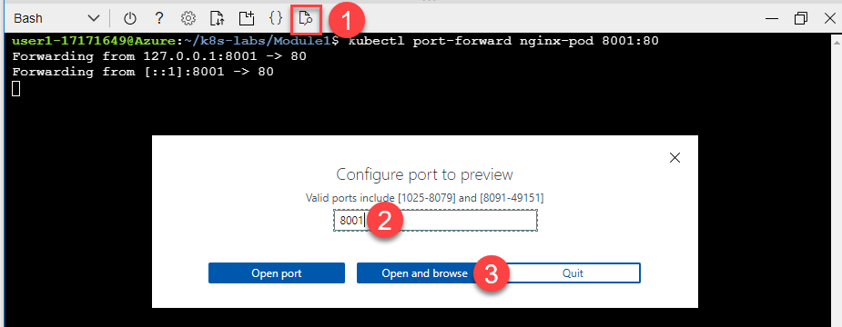   

   You should see a page that looks like the following   

      

3. Once you are finished, make sure to stop port forwarding by pressing 
   **control-C** key combination. If your host machine is Windows, try **Windows-C**
   key combination.  

**Task 3 - Deleting a running Pod**  

1. You are now going to delete **nginx-pod**. It may take few seconds to
   get deleted.  
   `kubectl delete pod nginx-pod`  

The Exercise on creating pods declaratively has been completed.  

## Exercise: Creating and Filtering Pods with Labels  

In this Exercise you will create a pod that has labels associated with
it. Labels make it easy to filter the pods later. Labels play vital role
in Kubernetes ecosystem, so it's important to understand their usage
properly.  

Resources needed to complete this exercise are available inside **module1** folder.  

## Tasks  

**Task 1 - Create a Pod declaratively**  

Open the **simple-pod-with-labels.yaml** file contains a pod definition which
is identical to **sample-pod.yaml**, except that it has two labels
assigned to it.  

1. Run the command to create the pod  
   `kubectl apply -f simple-pod-with-labels.yaml`  

2. Now, make sure pod is up and running  
   `kubectl get pods`  

   You should see pod named **nginx-pod-with-labels** running.  

**Task 2 - Show all labels that assigned to a pod**  

When you run `kubectl get pods` command, it won't show labels
associated with the pods.  

1. To get labels related information, use the command with the
   **--show-labels** switch    
   `kubectl get pods --show-labels`  

2. If you want to get labels that are assigned to a specific pod, then use the name of pod in the command  
   `kubectl get pods nginx-pod-with-labels --show-labels`  

**Task 3 - Filtering pods based on a label**  

1. Let's say you want to only list pods that have a label named
   **kind=web** associated with them. You can use **-l** switch to apply
   filter based on labels.  
   `kubectl get pod -l kind=web`  

2. To prove that it works as expected, run the command again but change
   the value of label **kind** to **db**. Notice, this time command won't
   return any pods because we don't have any pod with label **kind** with
   the value **db**.  
   `kubectl get pod -l kind=db`  

## Exercise: Adding/Updating/Deleting Labels on a Pod  

In this Exercise, you will create a pod that has labels associated with it.
Labels make it easy to filter the pods later. Labels play a vital role in the
Kubernetes ecosystem, so it's important to understand their proper usage.  

## Tasks  

**Task 1 - Assigning a new label to a running Pod**  

1. You can assign a new label (key=value) pair to a running pod. This
   comes in handy when you are troubleshooting an issue and would like to
   distinguish between different pod(s). In this case, we will assign a
   new label **health=fair** to the pod **nginx-pod-with-labels**, which is
   already running.  
   `kubectl label pod nginx-pod-with-labels health=fair`  

2. Now run the command to show the pod labels. Notice now, that an
   additional label is added to the pod.  
   `kubectl get pods nginx-pod-with-labels --show-labels`  

**Task 2 - Updating the value of an existing label that is assigned to a running pod**  

1. You can also update the value of an existing label that is assigned
   to a running pod. Let's change the value of the label **kind=web** to
   **kind=db** that is assigned to **nginx-pod-with-labels** pod.

1. Run the following command  
   `kubectl label pod nginx-pod-with-labels kind=db`  
   Notice you get an error message saying that the value already exists

1. Try again this time use the **overwrite flag** 
   `kubectl label pod nginx-pod-with-labels kind=db --overwrite`  

   **--overwrite** is needed because the pod is running and won't accept changes
   otherwise.  

1. Now run the command to show the pod labels. Notice now, that kind has
   changed from **web** to **db**.  
   `kubectl get pods nginx-pod-with-labels --show-labels`  

**Task 3 - Deleting a label that is assigned to a running Pod**  

1. Let's delete a label **health** that we assigned earlier to the
   **nginx-pod-with-labels** pod  
   `kubectl label pod nginx-pod-with-labels health-`  

>Notice the minus (**-**) sign at the end of the command. You can also remove
a label from all running pods by using the **--all** switch  
`kubectl label pod health- --all`  

2. Now run the command to show the pod labels. Notice now, that health is
   not part of labels.  
   `kubectl get pods nginx-pod-with-labels --show-labels`  

**Task 4 - Deleting the Pod**  

1. To delete the Pod, run the following command:  
   `kubectl delete pod nginx-pod-with-labels`  

## Exercise: Working with ReplicaSets  

In this Exercise, you will create a ReplicaSet, which will ensure that
there are always a specified number of Pods running in the cluster. Label
selectors are used in the ReplicaSet as a criteria to match the pods.
Any time the total number of matching Pods falls below the specified
number defined in the ReplicaSet definition, the ReplicaSet controller
will make sure it brings the actual number of Pods back to the specified
value.  

A ReplicaSet may create/delete Pods any time it sees the total number of
Pods fall below or above the specified value. In doing so, it may
terminate or create new Pods but it never relocates or migrates them.  

## Tasks  

**Task 1 - Creating Pods using a ReplicaSet**  

The **ng-rc.yaml** file contains a ReplicaSet definition that contains
Pod definitions, as well as a count for the number of Pods that need
to be running at any given point in time. 

1. Open **ng-rc.yaml** and verify  the matchLabel field that contains **key=value** that match the Pods labels.  

1. Run the command to create a ReplicaSet.  
   `kubectl apply -f ng-rc.yaml`  

1. Now, run the following command to see two new Pods created by the
   ReplicaSet  
   `kubectl get pods --show-labels`  

**Task 2 - Testing the ReplicaSet Controller**  

With the Pods up and running, you will check to see if the ReplicaSet
controller is working as expected. You will do that by removing the
label (**target**) from one of Pods created by the ReplicaSet. This
should immediately force ReplicaSet to spin up a new Pod since the
**matchLabels** criteria demands a minimum of two Pods with the label
(**target=dev**).  

1. First, remove the label (you should have listing of Pods along with
   their names from pervious step)  
   `kubectl label pod <POD-NAME> target-`  

1. Now, run the following command to see one new Pod created by the
   ReplicaSet, while an old Pod is still running.  
   `kubectl get pods --show-labels`  

1. You can delete the additional Pod manually, but a better way to do
   that is by assigning the (**target=dev**) label back to the Pod. This
   will make the ReplicaSet terminate one of the Pods to ensure that
   the total Pod count remains as two (and not three).  
   `kubectl label pod <POD-NAME> target=dev`    

1. Now run the following command to see one one of the pods have been terminated and only two are running.  
   `kubectl get pods --show-labels`

**Task 3 - Deleting the ReplicaSet**  

1. To delete the ReplicaSet, run the following command:  
   `kubectl delete rs nginx-replica-set`  

   This will delete not only the ReplicaSet, but also all the Pods that
   it was controlling by using the matching label criteria.  

**Task 4 - Deleting any remaining Pod**

Run these commands or clean any remaining pods:  
`kubectl get pods`  
`kubectl delete pod <POD-NAME>`  

## Exercise: Working with Deployments

In this Exercise, you will create a Deployment and roll out an
application update. Deployments provide a consistent mechanism for you
to upgrade to a new version of an application while making sure there is
no or very little downtime. Please note that internally, Deployments use
ReplicaSets for managing Pods. However, you don't need to work directly
with ReplicaSets, since Deployments abstract out that interaction.  

## Tasks  

**Task 1 - Creating a new Deployment**  

The **ng-dep.yaml** file contains a Deployment definition. The Pod is going to create a nginx container with a tag **1.0**. The **1.0** represents the version number of this container and hence the application running inside it.

1. Open **ng-dep.yaml**.  You will notice this is nearly identical to the ReplicaSet definition that
you used before.  Verify that the **kind** attribute is set to **Deployment**     

1. Run this command to create a Deployment and associated ReplicaSet.  
   `kubectl apply -f ng-dep.yaml`  

1. Now, run the following command to see new the Pods that are created.  
   `kubectl get pods --show-labels`  
   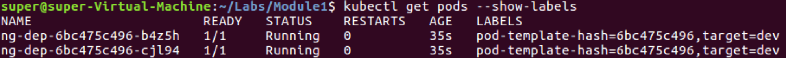   

**Task 2 - Accessing the 1.0 version of application**  

1. You will now browse to the nginx container by using the **port-forward**
   command. First write down the pod name as displayed by the output
   from the previous command. Just choose one of the pod's names, it's
   not important which one you choose.  
   `kubectl port-forward <POD-NAME> 8001:80`  

2. Open the cloud shell web preview configured for port **8001**
     

   You should see the following web page
   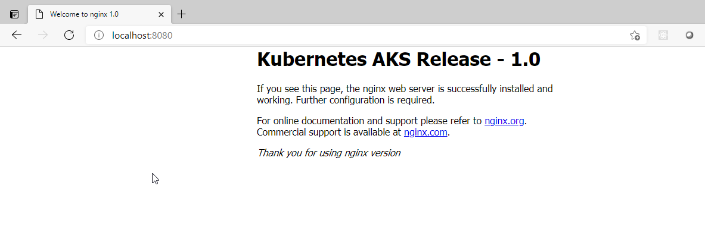  

**Task 3 - Updating the Deployment with 2.0 version**  

You are now going to update the deployment to run the **2.0** version of
the container instances instead of **1.0**. This can be done in two ways. The
approach taken in this task is going to show you the imperative way
of doing it, which is faster and will help you shorten your time
during dev/test of your application. The alternate approach is what
you have seen so far where you would use a YAML file.  

Make sure to stop the port forwarding before proceeding further. You
can use **Windows-C** or **Command-C** key combination to terminate it.  

1. To start rolling out the new update, you will tell the deployment to
   change the container image tag from **1.0** to **2.0** by running the
   command:  
   `kubectl set image deployment ng-dep nginx=k8slab/nginx:2.0`  

2. In the command above, **ng-dep** is the name of deployment and **nginx** is the
   name assigned to the container within the Pod template. Since the
   original version of the deployment was using the **1.0** tag to pull down the
   container image, the above command will force the deployment to roll out
   a new deployment with image tagged as **2.0**  

3. Now, list all the pods and notice that old pods are terminating, and the
   new pods have been created.    
   `kubectl get pods`  
    

4. Record the name of one of the newly created pods (the one created most
   recently).  

5. Look at the deployment definition with the updated value
   of container image, run the following command:  
   `kubectl describe deployment ng-dep`  
     

>Notice the Image section (under Containers) with the value of container
>image being updated to **2.0**.

**Task 4 - Accessing the 2.0 version of application**  

1. You will now browse to the **nginx** container by using the **port-forward**
   command. Replace the pod name by the one you noted in the last **get pods** command.    
   `kubectl port-forward <POD-NAME> 8001:80`  

2. Open the cloud shell web preview configured for port **8001**

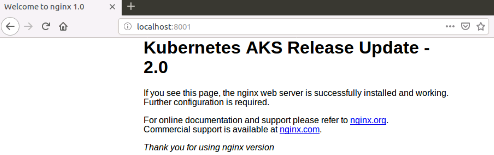  

3. Make sure to stop the port forwarding before proceeding further. You
   can use **Windows-C** or **Command-C** key combination to terminate it.   


## Exercise: Working with Services  

In this Exercise you will create a simple Service. Until now, you have
been using the **port-forward** command to gain access to the Pods.
Although, this works fine during dev/test, this approach does not really
scale. Services help you expose Pods externally using label selectors.  

## Tasks  

**Task 1 - Creating a LoadBalancer Service**  

The **ng-svc.yaml** file contains a Services definition. Services use
label selectors to determine which Pod it needs to track and forward
the traffic.

1. Let's start by taking at a look at running Pods and their labels.  
   `kubectl get pods --show-labels`  

   Notice the label **target=dev** that is associated with the pods.  

2. Open the **ng-svc.yaml** file and examine the **selector** attribute that is followed by **target=dev**. This essentially means that this Service will track all Pods that have label **target=dev** and forward traffic to them.  

3. Run the following command to create the Service:  
   `kubectl apply -f ng-svc.yaml`  

4. Now, check the of newly created service:  
   `kubectl get svc -o wide`  
  

The command above will display the details of all available services
along with the label selectors. You should see in the output, **ng-svc**
with a **EXTERNAL-IP**, **PORTS 80:30101/TCP** and **SELECTOR target=dev**.  

**Task 2 - Accessing the ng-svc Service**  

1. Open a browser and navigate to the **EXTERNAL-IP** address shown in the output of the previous command.  

  

**Task 3 - Creating a ClusterIP Service**  

There are times when you will need to create service that is only used inside of your cluster.  For example you may have an API  running that is only used by other applications and not intended for public use. In those cases you will create a service of type ClusterIP

1. Open the **ng-svc-clusterip.yaml** file and examine the **selector** attribute notice is is the same as our other service **target=dev**. But notice that the **type** is is missing.  In kubernetes the default type of a service is ClusterIP.  You could also explicitly declare the type also.
    
1. Run the following command to create the Service:  
   `kubectl apply -f ng-svc-clusterip.yaml`  

1. Now, check the of newly created service:  
   `kubectl get svc -o wide` 

1. Notice there is no public ip.
  

1. To test the service we can go into a pod and access the service:  
   `kubectl get pods`  
   `kubectl exec -it PODNAME -- bash`

1. Once inside the pods we first need to install curl.  
   `apt-get update`  
   `apt-get install -y curl`

1. Now view the default web page via the service.  
   `curl http://YOUR_CLUSTER_IP > index.html`  
   `cat index.html`
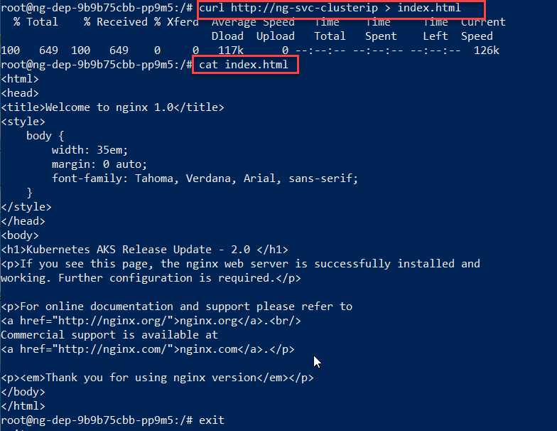  

1. Exit the pods by typing **exit**

**Task 4 - Deleting the Deployment and the Service**  

You are now going to delete Pods that were created earlier by
deleting the Deployment. Also, you will delete the Service.  

1. To delete the Deployment run the command:  
   `kubectl delete deployment ng-dep`  

2. To delete the both the Services run the command:  
   `kubectl delete service ng-svc ng-svc-clusterip`  

## Exercise: Working with Persistent Volumes Claims & Secrets  

This Exercise shows the use of secrets to hide the password needed by
WordPress to connect with MySQL. You will first create the secret
declaratively using a YAML file and then use the password within the deployment
files. Also, labels are used to ensure pods are tagged properly based on
their usage. For example, WordPress pod is assigned **tier=frontend** value.    

## Tasks  

**Task 1 - Create a secret declaratively**  

First you will create a new secret by using the **apply** command and
passing the secret definition as a YAML file. 

1. Open the **mysql-secret.yaml** YAML file and look at the data value which is encoded in base64. base64 encoding is required by Kubernetes.

1. Run the following command.  
`kubectl apply -f mysql-secret.yaml`  

1. To see the secret that was just created run this command.  
`kubectl get secret`  

1. To see the list of names of the secrets contents of the secret run the following.  
`kubectl describe secret mysql-password`  
  


**Task 2 - Deploy MySQL Pod (Single YAML file contains Deployment, Service and Volume Claims definitions)** 

1. Open the file **mysql-pvc-dep-svc.yaml** and examine it. Look for and examine the three different objects (**Service, PersistentVolumeClaim, Deployment**) that will be created. Find the **selector** and corresponding **labels**.

1. Run the following command: 
   `kubectl apply -f mysql-pvc-dep-svc.yaml`  

1. This may take few minutes. Run this command to make sure the pod is running before proceeding further.   
`kubectl get pods`

1. Once the pods are running everything should be created.  Let look for the persistent volume claim that was created.  
   `kubectl get pvc`

1. To get the details of the claim run the following command.  
   `kubectl describe pvc CLAIM_NAME`
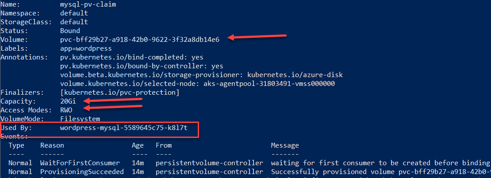  

1. Notice from the details that there was a volume created. Kubernetes automatically created that for us. You can create volumes for yourself also if you want more control over them.

1. To see the volumes that are available run this command.   
   `kubectl get pv`

1. Then to see the details of the volume run this command.  
   `kubectl describe pv VOLUME_NAME`

1. Look at the information and notice it is using **AzureDisk** as the storage.
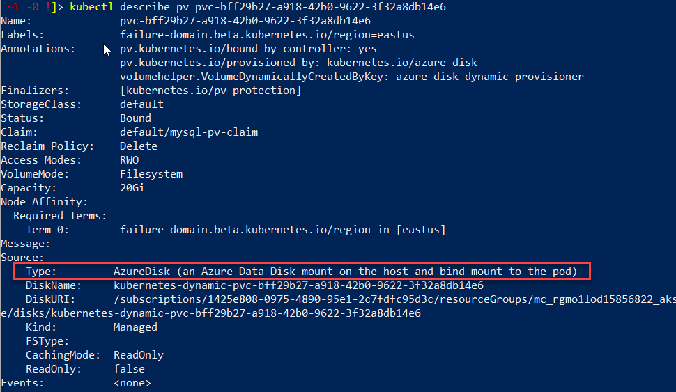  


**Task 3 - Deploy WordPress Pod (Single YAML file contains Deployment, Service and Volume Claims definitions)**  

1. Open the **wordpress-dep-svc-pvc.yaml** file and notice the pod is mounting a volume for the html files.
  


1. Run the following command:  
   `kubectl apply -f wordpress-dep-svc-pvc.yaml`  

1. Capture URL to access WordPress service.  Run the following command until the external IP goes from pending to
   an IP address.  
   `kubectl get svc`  
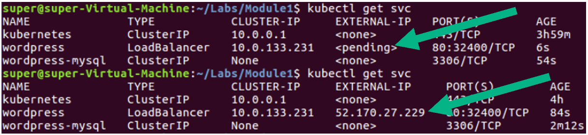  

1. Verify that the pods have started by running the following command until the status changes from **ContainerCreating** to **Running**
   `kubectl get svc`  
 


**Task 4 - Browse to the WordPress Website**  

1. Open a browser and navigate to **http://external-ip** you should see WordPress.  If the page does not load, wait a minute and try again.  

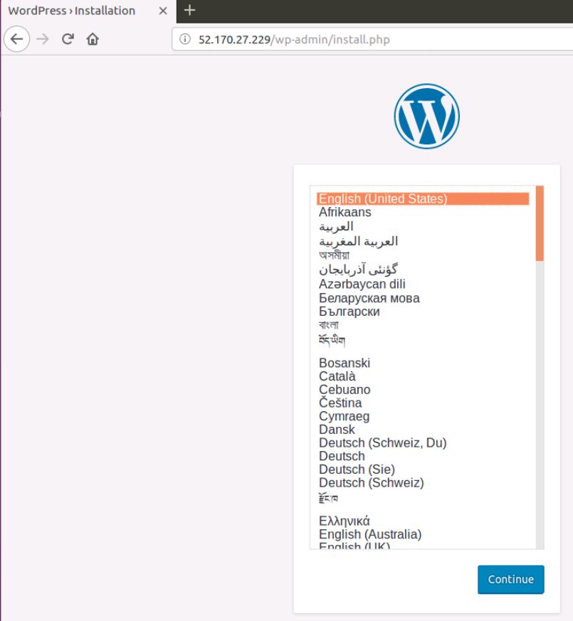  

1. Go ahead and fill out the required information (sitename, userid, password, email).  You do not need to save this information

1. Now navigate back to **http:/external-ip** and you should see the website home page.

1. Let's test it and make sure the data is being persisted and will live beyond the life of a pod.  First get the list of the pods that are running.  You should see a wordpress pod and a wordpress-mysql.  
   `kubectl get pods`
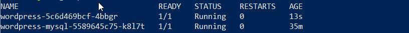  

1. Let's delete the wordpress pod.  
   `kubectl delete pod wordpress-XXXXXXX`

1. Now get the list of running pods again.  
   `kubectl get pods`

1. Notice that there is a NEW pod with different name, this is because Kubernetes automatically create a new as it is monitoring the deployment.
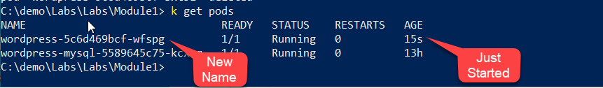  

1.  Refresh the browser to verify the website contents where saved.

1.  Repeat the above steps with the mysql pod and test to make sure it working as designed.

**Task 5 - Deleting Deployments and Services**  

You are now going to delete the Pods that were created earlier by first
deleting the Deployments. Also, you will delete the Services.  

1. To delete the Deployment run the command:  
   `kubectl delete deployment wordpress`  
   `kubectl delete deployment wordpress-mysql`  

2. To delete the Service run the command:  
   `kubectl delete svc wordpress`  
   `kubectl delete svc wordpress-mysql`  

# Congratulations you have completed The Lab


===

  

# Lab: Module 2 - Kubernetes Application Development on Azure  

>Duration: 90 minutes  

# Table of Contents

[Exercise: Working with Helm Charts](#exercise-working-with-helm-charts)

[Exercise: Working with Visual Studio Code](#exercise-working-with-visual-studio-code)


[Exercise: Working with Init Containers](#exercise-working-with-init-containers)

[Exercise: Working with PostStart Container Hooks](#exercise-working-with-poststart-container-hooks)


**Objectives**  

Lab provides exposure to various Kubernetes topics:  

  - Creating and deploying Kubernetes multi-container application using
Helm Charts  

  - Using Visual Studio Code to deploy Docker containers in AKS  
  
  - Creating and using InitContainers  

  - Creating and using PostStart container hooks  

  - Using ACI-Connector with Azure Kubernetes Service  

All the labs will require an AKS cluster to be up and running. Make sure you are connected to the AKS cluster with the following command executed in a terminal:  

`kubectl config current-context`  

It should return **aks-k8s-cluster**. If that is not the case, run:  

`az aks get-credentials --resource-group "USE CLOUD SLICE ASSIGNED RESOURCE GROUP" --name aks-k8s-cluster`  

## Exercise: Working with Helm Charts 

In this exercise you will use Helm charts to deploy a
multi-container application. Helm is a powerful tool that helps you manage
Kubernetes applications. Helm Charts are core components of Helm that
helps you define, install, and upgrade Kubernetes application.

The multi-container application consists of a front-end ASP .NET Core web
application and a Redis back-end. Overall, the application itself is
very simple but it helps you understand all the basic components of Helm.

## Tasks

**Task 1 - Understanding Helm Charts Structure**  

Helm charts follow a folder structure pattern. Typically, it looks like following  
    
    /parent-application    
    chart.yaml   
    /templates   
    /charts  
    /charts/application-1  
    /charts/application-1/templates  

In our case we have two applications. From the Helm charts
perspective, we have defined the **front-end** as the parent application and the **back-end** application sits below it.    
Lets' view the folder structure for **voting-application** that
contains Helm Charts for both the **front-end** and **back-end** application.

1. Run the following commands:  
   `cd ~/Labs/Module2`  
   `tree -d ./voting-app-helm`    
   **NOTE** if you are running from Powershell ommit the **-d**

   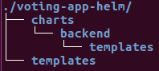  

2. Notice that you have a **templates** folder right underneath the main
   application folder and then another **charts** folder which also has another
   **templates** folder. Since we have two applications, **front-end** and
   **back-end**, we want to segregate the YAML files into two separate
   folders resulting in two charts. These charts are related because **front-end** and **back-end** are within the same root.  
   Let's explore more closely the YAML files within these folders. This
   will give you better understanding on how various files are placed
   within this hierarchy.

   `tree ./voting-app-helm`  
   **NOTE:** if you are running from Powershell use the command:   
   `tree /f ./voting-app-helm`  

  
>Helm Charts directory structure for complex applications can grow quite
>deep. Since we are just starting to work with Helm, keeping things
>simple make sense. However, you should look at the mature product like
>OpenStack and its entire Helm chart structure available at
><https://github.com/sapcc/helm-charts/tree/master/openstack>. This
>should give you a good idea on how Helm Charts are structure for more
>advanced applications.  
>Notice that inside the OpenStack Helm folder structure, how all the
>subcomponents are divided into sub charts (via sub folders). For
>example, Elektra is Web UI with a PostgreSQL backend sits level below
>within the main charts folder -
><https://github.com/sapcc/helm-charts/tree/master/openstack/elektra>  

3. Now back to our Chart. Let's examine these files closely. **Chart.yaml** is a Helm specific file
   that contains a basic set of information or metadata about the Helm
   application package. This includes application version number etc. Notice
   that there are two different **Chart.yaml** files, each file corresponds
   to one of the applications that we are planning to deploy (i.e.,
   front-end and back-end).  

4. Review the content of **Chart.yaml** file for the **front-end**
   application by running following command.  
   `cd voting-app-helm`  
   `cat Chart.yaml`  

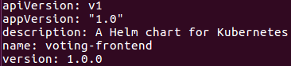   

​	Chart files do not contain application specific details
​	including image name, deployment, services etc. For that, you use
​	**values.yaml** file, which acts like a centralized location to define
​	application specific details for all the Kubernetes artifacts.  

5. Let's view the contents of **values.yaml** for the front-end
   application.  
   `cat values.yaml`  

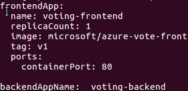  

​	Notice we have name, **replicaCount** etc. These are the values that we
​	will reference within the Deployment and Service definition files for
​	the **front-end** application.  

6. Let's view the content of **voting-frontend-dep.yaml** located in the
   templates folder.  

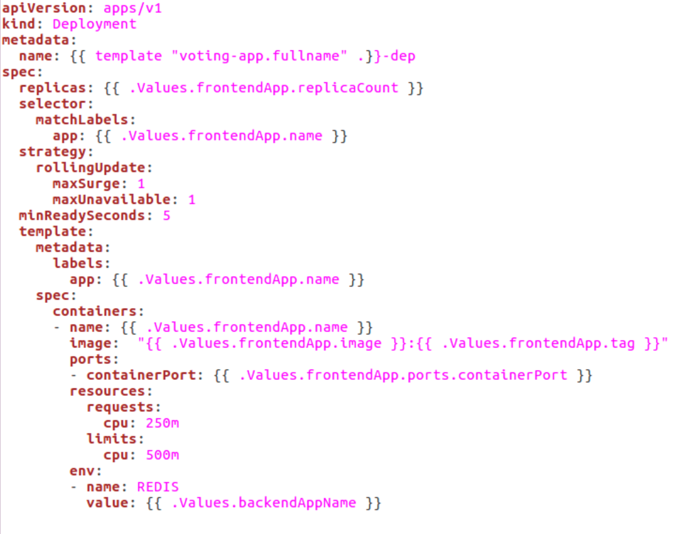

​	The deployment file for the **front-end** application is not much
​	different from the type deployment file you worked with before using
​	Helm, but it does contain placeholders for certain fields. These
​	placeholders will read the values from the **values.yaml** file and replace
​	the placeholder with that value. This way, you just focus on defining the
​	structure and leave most of the specifics to be defined in values file.
​	However, you can always define specific values and not read them from
​	values file. In this case notice that the values of CPU limits and
​	requests in the deployment file are hardcoded and are not read from
​	values file.  

7. At any point if you like to make sure that the Helm CLI is working correctly, run
   the following command:   
   ``helm version``  

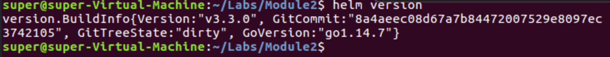


**Task 2 - Verifying a Helm Chart**

1. Before you deploy the chart, you can optionally verify it. This
   helps in making sure that everything is defined correctly, and all
   values are exactly what you want them to be.  
   `cd ~/Labs/Module2`  

2. To verify the helm chart run following command:  
   `helm template ./voting-app-helm`  

   The output of this command will display all the YAML files within the
   templates folder (for both **front-end** and **back-end**). Notice
   that the output contains the actual values for all the templates
   files after being replaced with the values from **values.yaml**
   file. These are the final values and if you found something missing
   or a discrepancy then you may want to change the **values.yaml**
   file as needed.   

**Task 3 - Installing a Helm Chart**  

1. Installing a Helm chart means that you will ask helm install all the deployments specified in your chart(s).  This will install the **front-end** and **back-end**
   applications through Helm chart. Notice you don't have to run the 
   `kubectl apply` command since Helm will take care of installing
   all the relevant files since you already defined them into the template
   folder earlier. Also, the **--name** parameter is used to give a unique name
   to this installation. In Helm, you refer to the installed application
   with a release name. To accomplish this all this automatically run the following
   command.  
   `helm install votingapp ./voting-app-helm`  


   Please note the installation may take few minutes.  Run the following command until the pods status changes to **Running**  
   `kubectl get pods`


**Task 4 - Listing a Helm Chart**  

1. You can list all the releases by running following command.  
   `helm ls`  

   The output will provide you with details including release name, status,
   chart details, app version etc.  

**Task 5 - Accessing Voting Application**  

1. Once deployed, you can run the following command to see the external
   IP created as part of the Load Balancer service.  
   `kubectl get svc`  

  

2. Open the browser and navigate to **http://\<external\_ip\>**. Once the
   application home page is displayed you should able to vote.  

  


**Task 6 - Upgrade Release**   

Now we will see how the upgrade process works Helm. 

1. Open the Chart.yaml file and update the appversion to 2.0.</br>
   appVersion: "2.0" </br>
   Now let us upgrade the Helm chart. 

   `helm upgrade votingapp ./voting-app-helm/`

   Now we will check the history of the deployment.

   `helm history votingapp`

   `helm ls`
 

**Task 7 - Rollback Release**   

1. We will see how the rollback process works Helm. Let us rollback to the previous release which is 1.0
   
   `helm rollback votingapp`

   Check the status of current release after the rollback.

   `helm ls`
 
   As you can see the release is rolled back to 1.0

**Task 8 - Deleting a Helm Chart**   

1. When you no longer need the application, you can delete the Helm
   chart. Remember, we have installed a multi-container application using
   a single command earlier, and now you can remove it again with simple
   commands. 

   `helm uninstall votingapp`  

   
## Exercise: Working with Visual Studio Code  

In this exercise, you will learn how Visual Studio Code can help when working
with Kubernetes clusters. Visual Studio Code provides a consistent user
experience across Windows, MAC OS and Linux operating systems.  

## Tasks

**Pre Task - Install Extensions**  
Make sure you have the latest versions of these extensions installed.  
 - Azure Tools
 - Kubernetes
 - Docker

**Task 1 - Creating Azure Container Registry**  

To share container images, private registries can be used like
[Azure Container
Registry](https://docs.microsoft.com/en-us/azure/container-registry/).
As part of this exercise, we will be using a private registry hosted
in Azure.  

1. First open VS Code and open the Command Palette as shown below (or
   with **control-shift-p**).  

  

  

2. Enter **Azure sign in** the text box and select **Azure sign in**. It will open
   a browser and walk you through the sign in experience to authenticate
   the IDE.  

  

3. Click on the Docker Icon on the left, and go inside of the registry section and Connect Registry to Azure.


4. Create Registry using this approach. Follow the next steps on creating the registry by providing it a unique name and other information.
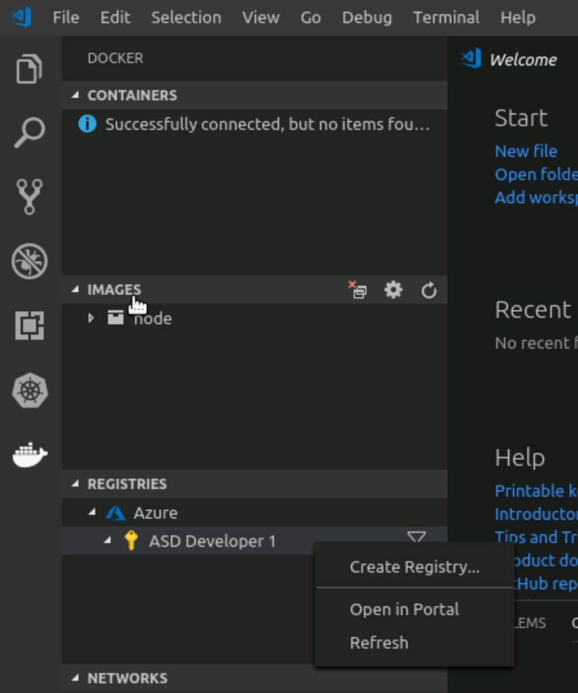

4. You will need to choose your subscription for billing purposes (select
   **Azure Pass** subscription). For the resource group, use the existing resource group you have.

   Then, you will need to select the Sku (keep **Standard**) and enter the Azure
   Container Registry name (it must be unique across all ofAzure) and location.
   At the end of these steps, you should see a notification saying that it
   has been successfully created (at the bottom right).  

5. To see the resource we have just deployed, navigate to
   [portal.azure.com](https://portal.azure.com/) and click on **All Services**.   

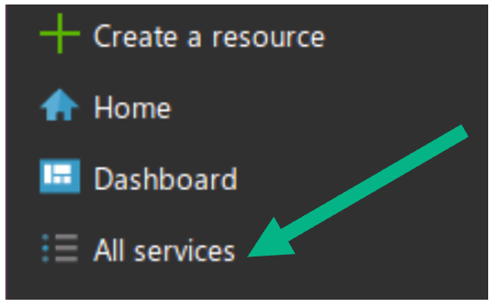  

6. Then enter **Container registries** and click on **Container registries**.    

  

7. Finally, click on the registry we just created to access the **Overview**
   page.  

  

8. We have deployed a private Docker Container registry in Azure from
   Visual Studio Code.  

**Task 2 - Connecting VS Code to you ACR account and Kubernetes cluster**   

1. Now that you have successfully deployed the ACR, we need to
   authenticate VS Code to this private registry. To do this, we need
   to browse to our Container Registry as explained in the previous
   section and go to **Access keys** to find the credentials as shown
   below.  

2. Enable **Admin user** and take note of the **Login server**, **Username** and
   **Password**.  

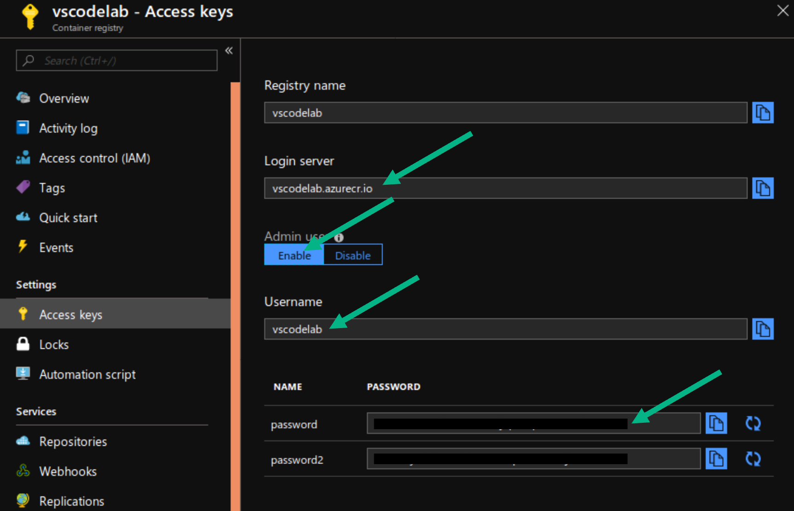  

3. From VS Code, open the **Settings** at the bottom left as shown below.  

  

4. Search for **vsdocker** and override the **Vsdocker: Image User** with
   name of the image. You need to put in the name of your login server, forward slash '/' and then vscodelab. What this does is place your container image into a repository named 'vscodelab'.

>   

5. At the top of VS Code, click on **Terminal** - **New Terminal**  

  

6. In the terminal window that has been opened, enter the command providing the username and the password found in the ACR environment.  
`docker login <login_server> -u <user_name> -p <password>`  


  

7. Before we can deploy a basic application to a Kubernetes cluster, we
   need to connect to the right cluster. Type the following commands from
   the VS Code terminal  
   `az login`  
   `az account set --subscription <YOUR-SUBSCRIPTION-ID>`  
   `az aks get-credentials --resource-group "USE THE CLOUD SLICE ASSIGNED RESOURCE GROUP" --name aks-k8s-cluster`  
   `kubectl config current-context`  

   It should return `aks-k8s-cluster`. If that is not the case, run:  
   `kubectl config set-context aks-k8s-cluster`   

**Task 3 - Deploy a NodeJS application to AKS from VS Code**    

1. From VS Code, click on **Explorer** and then **Open Folder**.  

     

1. Select the folder **~/labs/Module2/nodejs** and click **OK**. You can see
   the basic Node JS application provided, as well as a **Dockerfile** to
   build its image.  

   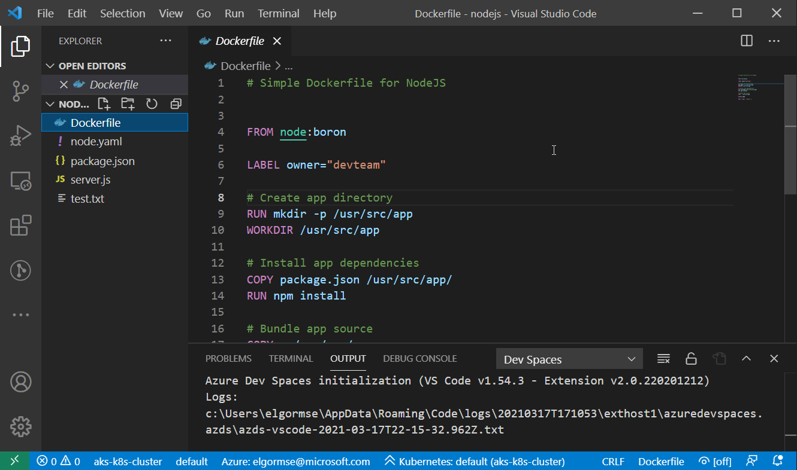  

1. Let's build the Docker image.  Right click on the **Dockerfile** and select **Build Image in Azure**

    

1. Enter **nodejs:latest"** as the Tag and press **Enter**
   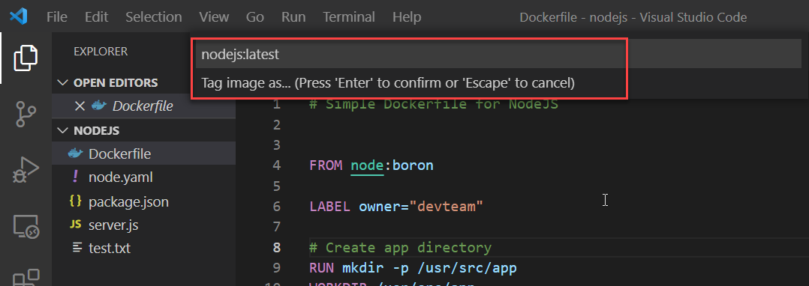 

1. Select the subscription that you want to use.  

1. Choose the registry that was previously created.  
   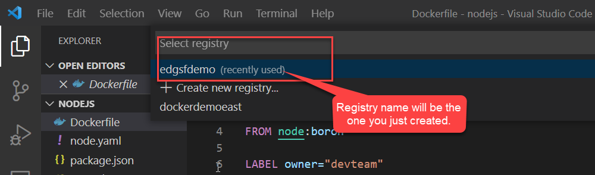 


1.  Choose **Linux** as the base OS.

1. The image should now build and be published to your registry.  Watch the **Output** window for details.

   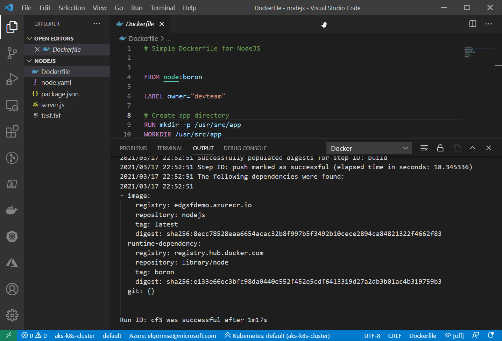

1. Now open the **node.yaml** file and update the image to to the use the registry name that you previously created.  NOTE:  The registry name should also be in the output window.

   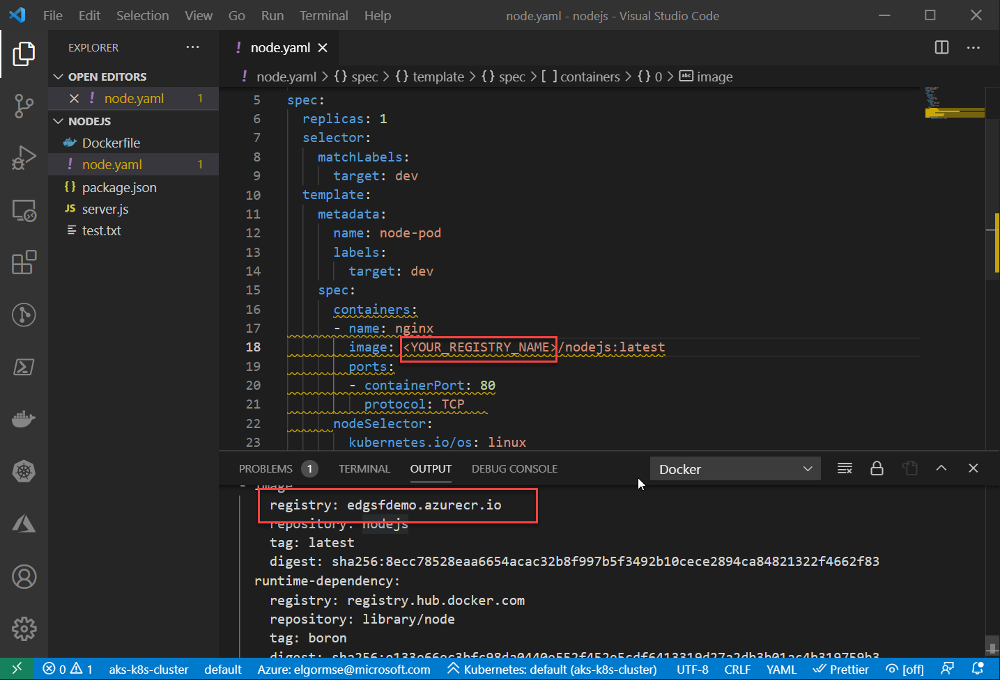

1. Now we will push the yaml file to our cluster.  Open Command Palette by clicking on the **Settings** icon and then **Command Palette**  

     


1. Type **Kubernetes Create** and select it. It will deploy the application into your AKS cluster.

   

​	You can follow these steps at the bottom left of the IDE. The deployment should be created.  

   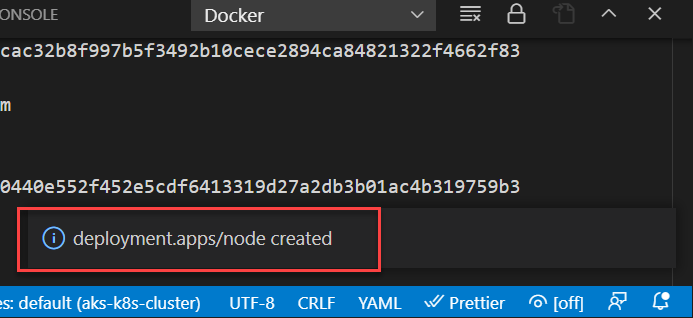  

5. Once complete, click on the Kubernetes extension, then expand the
   cluster and click **Workloads** - **Deployments** - **nodejs**. You will be able
   to see what is deployed in your cluster.    

   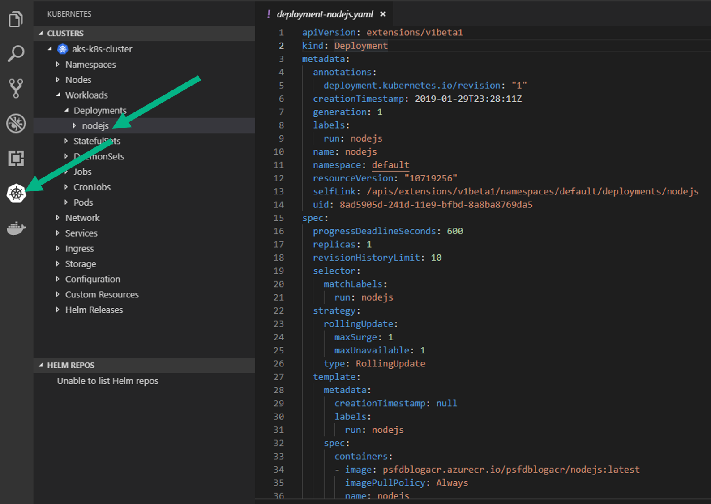  

**Task 4 - Troubleshooting and fixing a failing deployment**    

When expanding **nodejs**, you can see a red dot meaning that things did
not go as expected.  

1. Right-click on the failing pod and click **Describe**. 
- Scroll down and
   locate the message **Failed to pull image ...**, as highlighted in red
   below. If you scroll to the right, you will see that the pull failed
   because the AKS cluster is unauthorized to pull the image stored in
   the Azure Container Registry. We need to create a secret.  

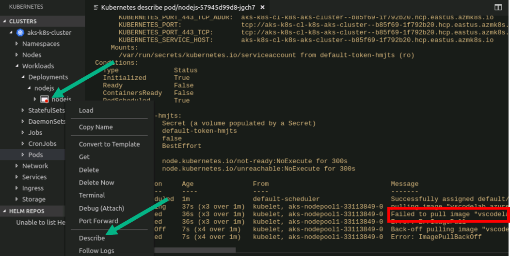  

2. To create a secret, open the VS Code Terminal and type the command  

``` bash
kubectl create secret docker-registry acr-auth  
    --docker-server=https://<acr_login_server>  
    --docker-username=<acr_user_name>  
    --docker-password=<acr_password>  
    --docker-email=<any_mail>
```

  

​	Although the secret is created, we need to make sure that its
​	credentials will be used to download the image at deployment time.  

3. From the Kubernetes extension window, click on the **nodejs** deployment
   to see the YAML file describing the deployment.  

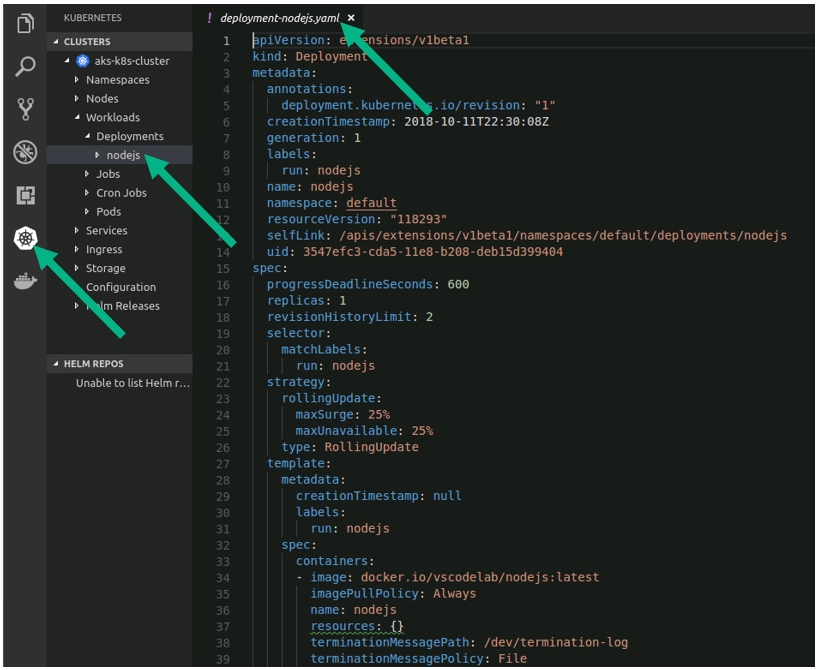  

4. After the **containers** section, update the file to add the following YAML section:  

``` yaml
imagePullSecrets:
  - name: acr-auth
```

  

5. Click **control-s** to save the changes and then finally, to update the deployment, open the Command Palette (or
   **control-shift-p**), search for **Apply** and select **Kubernetes: Apply**
   and click **Apply**.  

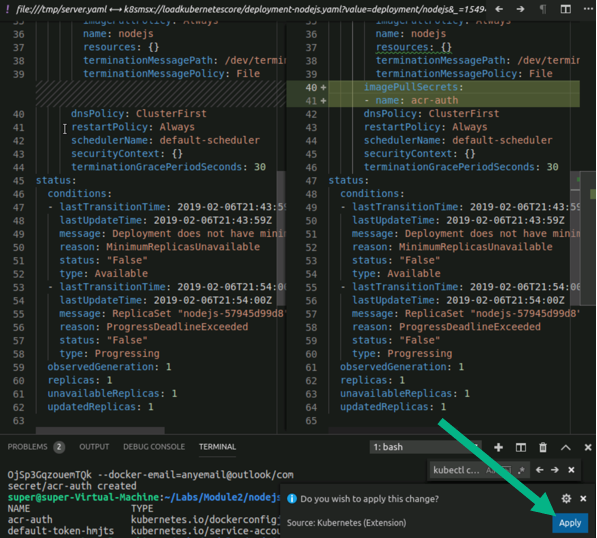  

6. Now if you refresh the cluster's view, the **nodejs** pod should be healthy once the pull is complete. It will take a bit of time. Feel free to right click on the pod and **Describe**, it should show the event **pulling image...**   

   

**Task 5 - Exposing the deployment publicly with services**    

1. From the cluster's view, if you look under **Services**, you will see
   that the Node JS application is deployed but is not exposed through
   a service. To do this, open the Terminal and run  
   `kubectl expose deployments/nodejs --port=80 --target-port=8080 --type=LoadBalancer`  

  

​	Note the target port, which is 8080 because, as specified on the
​	**Dockerfile** that we used to build the image, we expect traffic to
​	come through the port 8080 in the container.  

2. Just like you did from the Linux terminal, we can follow the service
   creation from the VS Code terminal with the command (we can also do
   that by right clicking on the **nodejs** service created under **Services**
   and click **Get**):  
   `kubectl get svc`  

   

3. Once the service has been set up and the IP address has been created
   in Azure, you can refresh the cluster view and call the IP address
   from any browser.    

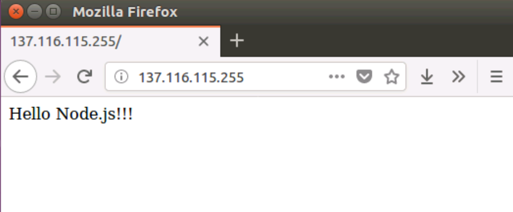  

**Task 6 - Exploring more VS Code features**     

1. Another convenient integrated tool part of the Kubernetes extension
   is the `kubectl explain` command. Open a YAML file by clicking on **nodejs** deployment. Then open the Command Palette and enter
   **explain**. Then select **Kubernetes: Explain**.  

  

2. Now, hover over any field in the deployment YAML file to see some
   documentation and clickable links to learn more about the field.  

  

3. Finally, what you can do is open an interactive session with the running container for troubleshooting purpose. Right-click on the **nodejs** pod and
   click **Terminal**.  

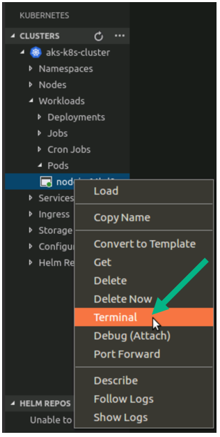  

4. You can type the `ls` or `cat server.js` commands to see what is inside the
   container file system. All of this, without leaving the VS Code IDE.  

  

**Task 7 - Cleaning up the Service and Deployment**    

1. From VS Code, we can also delete Kubernetes resources. Open the
   Command Palette, search for **Delete** and select **Kubernetes: Delete**.
   Type **service** and hit **enter**, this will delete the **nodejs** service.  

2. Start **Kubernetes: Delete** again, but this type **deployment** so that it
   deletes the **nodejs** deployment and clean everything up for the next
   exercise. You can refresh the cluster's view to check that **nodejs** is
   not under Deployments, Pods or Services.  


## Exercise: Working with Init Containers  

## Tasks  

**Task 1 - Creating the Init Container**  

First you will deploy the Pod that has both a regular application
container and the Init container defined.  

1. Make sure you are in a terminal window as super user and navigate to the
   **Labs/Module2**  
   `cd ~/Labs/Module2`  
   

2. You should open **init.yaml** and review its contents.  
   `cat init.yaml`  

3. Notice the use of the **initContainers** section with the command that
   checks if the **nginx** web server is accessible. As long as the nginx web server is not available, the init
   container will make sure that the application container, which is a busybox container, won't run.  
   `kubectl apply -f init.yaml`  

**Task 2 - Checking the Init Container**  

1. You should now check the status of the Pod.  
   `kubectl get pods`  

  

​	Notice that the status of **myapp-pod** shows **Init:0/1**. This means that 0 out of 1 init containers are still running. It will wait until init container's condition is satisfied and the main application pod won't run.  

2. You can check what's going on inside the Pod by running the command:  
   `kubectl describe pod myapp-pod`  

3. Scroll down to the conditions section within the output.  

  

4. Notice that the **myapp-container** is not initialized yet. This is
   exactly what you should expect because init container is still running.
   Lets' look at the logs to verify that.  
   `kubectl logs myapp-pod -c init-ngservice`  

   You should see "**Waiting for ngservice to come up**" message in the
   logs (ignore "**sh: 200: unknown operand**" message as it's not
   relevant).  

**Task 3 - Running the Init Container to Completion**  

1. Open **myservice.yaml**. Look for the two objects (a pod and a service) that will be created.  Verify the name of the service is the name that the init container is expecting.

1. To make sure that the init container condition has been met, run the following command. It's going to create a **nginx** service and pod The service endpoint, once up and running, will satisfy the init container condition since it will able to connect to it and get status 200 in return  
   `kubectl apply -f myservice.yaml`  


1. After waiting a bit, run the following command  
   `kubectl get pods`  

  

​	Notice that **myapp-pod** is now showing **Running** status (previously its **Init:0/1**), This means init container has completed its job and
​	is terminated.  

4. Now, check the logs for application container  
   `kubectl logs myapp-pod`  

5. Notice the message in the logs "**The app is running".** You can
   also run the *describe* command to gather more details about the Pod.  
   `kubectl describe pod myapp-pod`  

  

**Task 4 - Deleting Resources**  

Make sure to delete relevant resources before finishing this exercise.  
`kubectl delete svc ngservice`  
`kubectl delete pod myapp-pod ng-pod`  


## Exercise: Working with a PostStart Container Hooks   

A PostStart hook gets executed immediately after the container's main
process is started. Typically, you use a PostStart hook to perform extra
processing when the application starts. It especially comes in handy when
you don't have the application source code (third party applications) yet
still want to execute some logic as the container gets started.  

Please note that the hook runs in parallel (asynchronously) with the main
process, despite what its name suggest. So, don't assume that the main
process will wait for the post start hook to complete. However, if the post
start hook fails (return a non-zero exit code), the main container will
be killed.  

## Tasks  

**Task 1 - Creating a Pod with a Post Start Container Hook**  

The **hooks.yaml** file contains the Pod definition along with the
command that will run as the PostStart container hook executes.  

1. Open **hooks.yaml** and look at the **lifecycle** section.  In here you see the postStart hook and command that will be executed.  

1. Run the following command, to create a Pod with liveness probe.  
   `kubectl apply -f hooks.yaml`  

1. Wait for 5 seconds and then run the command to view Pod details.  
   `kubectl describe pods hooks`  

1. Scroll down and locate the **Events** section. The PostStart hook first
   echoed a message, then slept for 3 seconds and finally returned an
   exit code -1. Since the exit code is non-zero, the container was killed
   and re-created again. Initially, you will see **PostStartHookError**
   within the events section. However, as the PostHook will run again and
   once again returns an exit code of -1, the container will be killed again and re-created.  
   Again take a look at the yaml file we deployed to understand how the hook was specified and defined  
   `cat hooks.yaml`  

1. After a bit you can see how many times kubernets has tried to restart the pod.  
   `kubectl get pods`

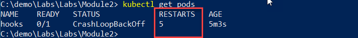

**Task 2 - Deleting the Pod**  

1. Make sure to delete the Pod before closing this exercise  
   `kubectl delete pod hooks`  


## Exercise: Windows Server container on an Azure Kubernetes Service (AKS)
 In the Module 2, there is a yaml file called windows.yaml.

1. Open the **windows.yaml** file and examine it.

1. Notice that this **nodeSelector** is looking for an **os type** of **Windows**.  This is tell Kubernetes to only place this pod on a node that is running Windows. Also notice the image name and that it is using an aspnet image pulled from Microsoft's registry.

1. Run the following command, to create a Windows Container using windows.yaml file.  
   `kubectl apply -f windows.yaml`  

1. It may take a minute for this to start, so run this command until the status is **Running**.  
   `kubectl get pods`

1. Get the public ip address to access the app by **Running**.  
   `kubectl get svc`

1.  Open a browser and verify the app is running.
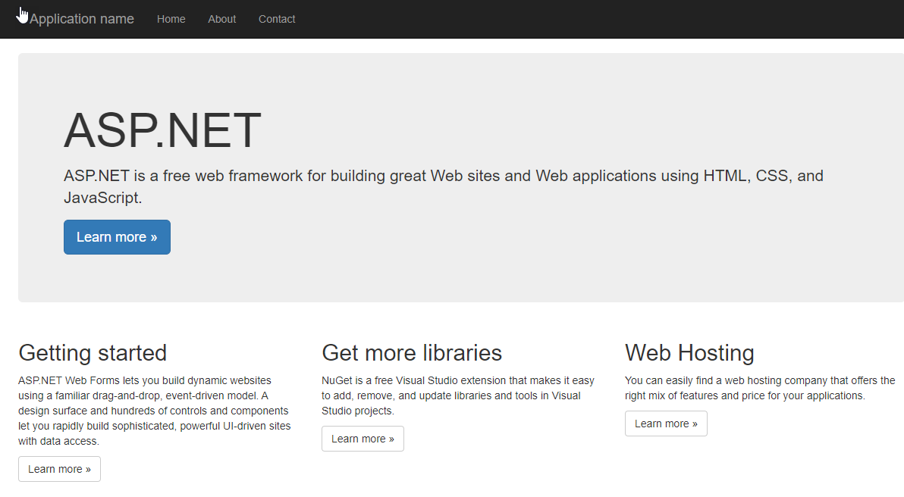

1. Get the pod information and find out what node it is running on and get the node name.  
   `kubectl get pods`  
   `kubectl describe pod PODNAME`
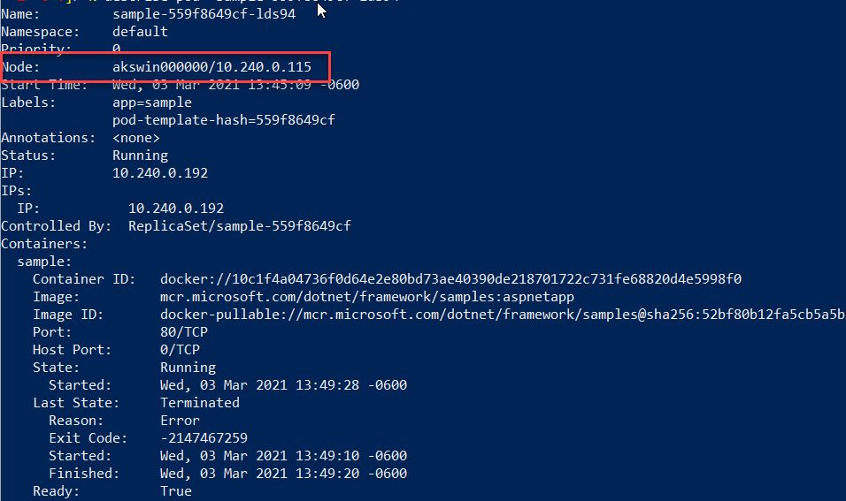

1. Examine the details of the node and verify it is running Windows for the OS.  
   `kubectl describe node NODENAME`

1. You can find OS information in the **Labels** section.  
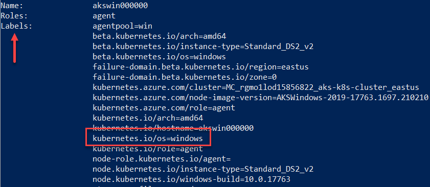

1. You can also find OS information in the **System Info** section.
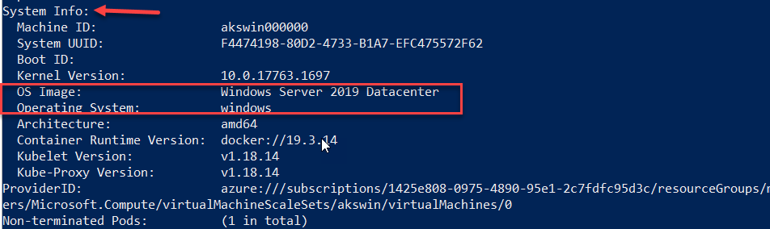

1. Clean up the deployment.  
   `kubectl delete -f windows.yaml`  

# Congratulations you have completed the Lab.