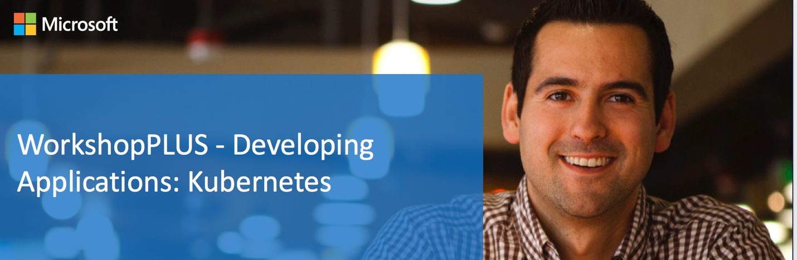
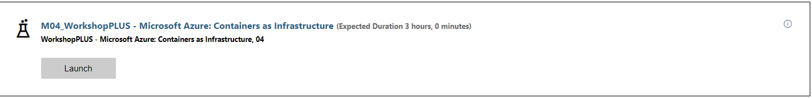

  

# Lab: Module 1 - Kubernetes Core Concepts  

>Duration: 90 minutes  

# Table of Contents

[Exercise: Create an Azure Kubernetes Service (AKS) Cluster](#exercise-create-an-azure-kubernetes-service-aks-cluster)  


[Exercise: Creating a Pod Declaratively](#exercise-creating-a-pod-declaratively)  

[Exercise: Creating and Filtering Pods with Labels](#exercise-creating-and-filtering-pods-with-labels)   

[Exercise: Adding/Updating/Deleting Labels on a Pod](#exercise-addingupdatingdeleting-labels-on-a-pod)  

[Exercise: Working with ReplicaSets](#exercise-working-with-replicasets)  

[Exercise: Working with Deployments](#exercise-working-with-deployments)  

[Exercise: Working with Services](#exercise-working-with-services)  

[Exercise: Working with Persistent Volumes Claims & Secrets](#exercise-working-with-persistent-volumes-claims-secrets)  

**Objectives**  

This lab provides walkthroughs on various Kubernetes topics:  

  - Creating an AKS cluster  

  - Creating, deploying, and deleting Pods  

  - Deployments, Services, Volumes and Secrets  

  - Working with Labels and Annotations  

### Login to your Azure Subscription
Launch Lab environment for Module 4 (this may take several minutes)

  

On the the **resources** tab then **Use Another Account**


Login into your lab Azure Subscription using the credentials provided on the resources tab


## Exercise: Create an Azure Kubernetes Service (AKS) Cluster  

In this exercise you will create an AKS cluster.  

## Tasks  

**Task 1 - Creating the AKS cluster**  

1. Login to the Azure portal using the Cloud Slice credentials. In the Azure portal, click on **Create a resource** and type “kubernetes service” in the **Search** box.
  

2.	Click on the **Create Kubernetes service** button as shown below.
  

3. Next, you will see the Create Kubernetes Cluster blade, as shown below. For the Kubernetes version, choose the latest version.
  

 1. Use the Cloud Slice assigned resource group 
 2. Name the cluster **aks-k8s-cluster**
 3. Choose East US as the Azure Region (or your local Azure region)
 4. Select the default version of AKS
 5. Select a Standard DS2 v2 machine size
 6. Set the Node Count to 2

4. Click on the Next to go to Node Pools.


6. Click on the **Next: Authentication** button. On the Authentication page, accept the default **System-assigned managed identity** and ensure that the Enable RBAC (Role-Based Access Control) is set to **Disabled**.

  

7. Click on the **Next**: **Networking** button.
Make sure you choose the Azure CNI option.  Leave the other settings as there are set.

  

9. Make sure in the Integration Section, Disable Container Monitoring
  

10. Keep the other sections as-is and click on the **Review + Create** menu item as shown below.
  

11.  Then after the validation has passed click on the **Create**.

    

>It may take approximately 10 minutes for the cluster to provision
>successfully in the US. If you are in Europe, the provisioning may take
>about 30 minutes.  

## Exercise: Creating a Pod Declaratively  

This Exercise shows the use of YAML file to create a pod declaratively.  

## Tasks  

**Setup Environment - Open the Cloud Shell**

The first time you open the Cloud Shell you will need to create a storage account 

1. Click on the Cloud Shell
1. Choose Bash
1. Choose **Show Advanced Options** 
1. **Storage Account** type "cloudshell" plus your initials all lower case.  For example *cloudshellrrp*
1. **File Share** use *cloudshell*
1. click **Create Storage** (this will take a few minutes)


**Download Lab Files**
 1. From the Cloud Shell prompt type 

 ```git clone https://github.com/RandyPatterson/k8s-labs.git; cd ./k8s-labs/Module1```


**Connecting to your AKS cluster with Az Cli**

1. From the **Azure Cloud Shell** 

1. Run the following command to download the AKS Kubernetes cluster configuration to the local config file: **$HOME/.kube/config**  
   `az aks get-credentials --resource-group "USE CLOUD SLICE ASSIGNED RESOURCE GROUP" --name aks-k8s-cluster`  
**Use the Resource group assigned to your azure subscription**


**Task 1 - Create a Pod declaratively**  

1. To create a Pod, you will use the YAML file provided to you. You may
   want to open the **simple-pod.yaml** file and understand its contents.
   The pod definition contains the **Nginx** container to run at port 80
   inside the Pod.  
   `kubectl apply -f simple-pod.yaml`  

2. Now, make sure pod is up and running  
   `kubectl get pods`  

   You should see pod named **nginx-pod**   

**Task 2 - Accessing Nginx container running inside the Pod**  

1. One of the easiest ways to call a pod is to use a port forwarding technique. Run the port-forward command  
   `kubectl port-forward nginx-pod 8001:80`  

2. Browse to the **Nginx** Website. From the Cloud Shell
   1. Open Web Preview
   1. Configure the port to 8001
   1. Click on **Open and Browse**
      

   You should see a page that looks like the following   

      

3. Once you are finished, make sure to stop port forwarding by pressing 
   **control-C** key combination. If your host machine is Windows, try **Windows-C**
   key combination.  

**Task 3 - Deleting a running Pod**  

1. You are now going to delete **nginx-pod**. It may take few seconds to
   get deleted.  
   `kubectl delete pod nginx-pod`  

The Exercise on creating pods declaratively has been completed.  

## Exercise: Creating and Filtering Pods with Labels  

In this Exercise you will create a pod that has labels associated with
it. Labels make it easy to filter the pods later. Labels play vital role
in Kubernetes ecosystem, so it's important to understand their usage
properly.  

Resources needed to complete this exercise are available inside **module1** folder.  

## Tasks  

**Task 1 - Create a Pod declaratively**  

Open the **simple-pod-with-labels.yaml** file contains a pod definition which
is identical to **sample-pod.yaml**, except that it has two labels
assigned to it.  

1. Run the command to create the pod  
   `kubectl apply -f simple-pod-with-labels.yaml`  

2. Now, make sure pod is up and running  
   `kubectl get pods`  

   You should see pod named **nginx-pod-with-labels** running.  

**Task 2 - Show all labels that assigned to a pod**  

When you run `kubectl get pods` command, it won't show labels
associated with the pods.  

1. To get labels related information, use the command with the
   **--show-labels** switch    
   `kubectl get pods --show-labels`  

2. If you want to get labels that are assigned to a specific pod, then use the name of pod in the command  
   `kubectl get pods nginx-pod-with-labels --show-labels`  

**Task 3 - Filtering pods based on a label**  

1. Let's say you want to only list pods that have a label named
   **kind=web** associated with them. You can use **-l** switch to apply
   filter based on labels.  
   `kubectl get pod -l kind=web`  

2. To prove that it works as expected, run the command again but change
   the value of label **kind** to **db**. Notice, this time command won't
   return any pods because we don't have any pod with label **kind** with
   the value **db**.  
   `kubectl get pod -l kind=db`  

## Exercise: Adding/Updating/Deleting Labels on a Pod  

In this Exercise, you will create a pod that has labels associated with it.
Labels make it easy to filter the pods later. Labels play a vital role in the
Kubernetes ecosystem, so it's important to understand their proper usage.  

## Tasks  

**Task 1 - Assigning a new label to a running Pod**  

1. You can assign a new label (key=value) pair to a running pod. This
   comes in handy when you are troubleshooting an issue and would like to
   distinguish between different pod(s). In this case, we will assign a
   new label **health=fair** to the pod **nginx-pod-with-labels**, which is
   already running.  
   `kubectl label pod nginx-pod-with-labels health=fair`  

2. Now run the command to show the pod labels. Notice now, that an
   additional label is added to the pod.  
   `kubectl get pods nginx-pod-with-labels --show-labels`  

**Task 2 - Updating the value of an existing label that is assigned to a running pod**  

1. You can also update the value of an existing label that is assigned
   to a running pod. Let's change the value of the label **kind=web** to
   **kind=db** that is assigned to **nginx-pod-with-labels** pod.

1. Run the following command  
   `kubectl label pod nginx-pod-with-labels kind=db`  
   Notice you get an error message saying that the value already exists

1. Try again this time use the **overwrite flag** 
   `kubectl label pod nginx-pod-with-labels kind=db --overwrite`  

   **--overwrite** is needed because the pod is running and won't accept changes
   otherwise.  

1. Now run the command to show the pod labels. Notice now, that kind has
   changed from **web** to **db**.  
   `kubectl get pods nginx-pod-with-labels --show-labels`  

**Task 3 - Deleting a label that is assigned to a running Pod**  

1. Let's delete a label **health** that we assigned earlier to the
   **nginx-pod-with-labels** pod  
   `kubectl label pod nginx-pod-with-labels health-`  

>Notice the minus (**-**) sign at the end of the command. You can also remove
a label from all running pods by using the **--all** switch  
`kubectl label pod health- --all`  

2. Now run the command to show the pod labels. Notice now, that health is
   not part of labels.  
   `kubectl get pods nginx-pod-with-labels --show-labels`  

**Task 4 - Deleting the Pod**  

1. To delete the Pod, run the following command:  
   `kubectl delete pod nginx-pod-with-labels`  

## Exercise: Working with ReplicaSets  

In this Exercise, you will create a ReplicaSet, which will ensure that
there are always a specified number of Pods running in the cluster. Label
selectors are used in the ReplicaSet as a criteria to match the pods.
Any time the total number of matching Pods falls below the specified
number defined in the ReplicaSet definition, the ReplicaSet controller
will make sure it brings the actual number of Pods back to the specified
value.  

A ReplicaSet may create/delete Pods any time it sees the total number of
Pods fall below or above the specified value. In doing so, it may
terminate or create new Pods but it never relocates or migrates them.  

## Tasks  

**Task 1 - Creating Pods using a ReplicaSet**  

The **ng-rc.yaml** file contains a ReplicaSet definition that contains
Pod definitions, as well as a count for the number of Pods that need
to be running at any given point in time. 

1. Open **ng-rc.yaml** and verify  the matchLabel field that contains **key=value** that match the Pods labels.  

1. Run the command to create a ReplicaSet.  
   `kubectl apply -f ng-rc.yaml`  

1. Now, run the following command to see two new Pods created by the
   ReplicaSet  
   `kubectl get pods --show-labels`  

**Task 2 - Testing the ReplicaSet Controller**  

With the Pods up and running, you will check to see if the ReplicaSet
controller is working as expected. You will do that by removing the
label (**target**) from one of Pods created by the ReplicaSet. This
should immediately force ReplicaSet to spin up a new Pod since the
**matchLabels** criteria demands a minimum of two Pods with the label
(**target=dev**).  

1. First, remove the label (you should have listing of Pods along with
   their names from pervious step)  
   `kubectl label pod <POD-NAME> target-`  

1. Now, run the following command to see one new Pod created by the
   ReplicaSet, while an old Pod is still running.  
   `kubectl get pods --show-labels`  

1. You can delete the additional Pod manually, but a better way to do
   that is by assigning the (**target=dev**) label back to the Pod. This
   will make the ReplicaSet terminate one of the Pods to ensure that
   the total Pod count remains as two (and not three).  
   `kubectl label pod <POD-NAME> target=dev`    

1. Now run the following command to see one one of the pods have been terminated and only two are running.  
   `kubectl get pods --show-labels`

**Task 3 - Deleting the ReplicaSet**  

1. To delete the ReplicaSet, run the following command:  
   `kubectl delete rs nginx-replica-set`  

   This will delete not only the ReplicaSet, but also all the Pods that
   it was controlling by using the matching label criteria.  

**Task 4 - Deleting any remaining Pod**

Run these commands or clean any remaining pods:  
`kubectl get pods`  
`kubectl delete pod <POD-NAME>`  

## Exercise: Working with Deployments

In this Exercise, you will create a Deployment and roll out an
application update. Deployments provide a consistent mechanism for you
to upgrade to a new version of an application while making sure there is
no or very little downtime. Please note that internally, Deployments use
ReplicaSets for managing Pods. However, you don't need to work directly
with ReplicaSets, since Deployments abstract out that interaction.  

## Tasks  

**Task 1 - Creating a new Deployment**  

The **ng-dep.yaml** file contains a Deployment definition. The Pod is going to create a nginx container with a tag **1.0**. The **1.0** represents the version number of this container and hence the application running inside it.

1. Open **ng-dep.yaml**.  You will notice this is nearly identical to the ReplicaSet definition that
you used before.  Verify that the **kind** attribute is set to **Deployment**     

1. Run this command to create a Deployment and associated ReplicaSet.  
   `kubectl apply -f ng-dep.yaml`  

1. Now, run the following command to see new the Pods that are created.  
   `kubectl get pods --show-labels`  
      

**Task 2 - Accessing the 1.0 version of application**  

1. You will now browse to the nginx container by using the **port-forward**
   command. First write down the pod name as displayed by the output
   from the previous command. Just choose one of the pod's names, it's
   not important which one you choose.  
   `kubectl port-forward <POD-NAME> 8001:80`  

2. Open the cloud shell web preview configured for port **8001**
     

   You should see the following web page
     

**Task 3 - Updating the Deployment with 2.0 version**  

You are now going to update the deployment to run the **2.0** version of
the container instances instead of **1.0**. This can be done in two ways. The
approach taken in this task is going to show you the imperative way
of doing it, which is faster and will help you shorten your time
during dev/test of your application. The alternate approach is what
you have seen so far where you would use a YAML file.  

Make sure to stop the port forwarding before proceeding further. You
can use **Windows-C** or **Command-C** key combination to terminate it.  

1. To start rolling out the new update, you will tell the deployment to
   change the container image tag from **1.0** to **2.0** by running the
   command:  
   `kubectl set image deployment ng-dep nginx=k8slab/nginx:2.0`  

2. In the command above, **ng-dep** is the name of deployment and **nginx** is the
   name assigned to the container within the Pod template. Since the
   original version of the deployment was using the **1.0** tag to pull down the
   container image, the above command will force the deployment to roll out
   a new deployment with image tagged as **2.0**  

3. Now, list all the pods and notice that old pods are terminating, and the
   new pods have been created.    
   `kubectl get pods`  
    

4. Record the name of one of the newly created pods (the one created most
   recently).  

5. Look at the deployment definition with the updated value
   of container image, run the following command:  
   `kubectl describe deployment ng-dep`  
     

>Notice the Image section (under Containers) with the value of container
>image being updated to **2.0**.

**Task 4 - Accessing the 2.0 version of application**  

1. You will now browse to the **nginx** container by using the **port-forward**
   command. Replace the pod name by the one you noted in the last **get pods** command.    
   `kubectl port-forward <POD-NAME> 8001:80`  

2. Open the cloud shell web preview configured for port **8001**

  

3. Make sure to stop the port forwarding before proceeding further. You
   can use **Windows-C** or **Command-C** key combination to terminate it.   


## Exercise: Working with Services  

In this Exercise you will create a simple Service. Until now, you have
been using the **port-forward** command to gain access to the Pods.
Although, this works fine during dev/test, this approach does not really
scale. Services help you expose Pods externally using label selectors.  

## Tasks  

**Task 1 - Creating a LoadBalancer Service**  

The **ng-svc.yaml** file contains a Services definition. Services use
label selectors to determine which Pod it needs to track and forward
the traffic.

1. Let's start by taking at a look at running Pods and their labels.  
   `kubectl get pods --show-labels`  

   Notice the label **target=dev** that is associated with the pods.  

2. Open the **ng-svc.yaml** file and examine the **selector** attribute that is followed by **target=dev**. This essentially means that this Service will track all Pods that have label **target=dev** and forward traffic to them.  

3. Run the following command to create the Service:  
   `kubectl apply -f ng-svc.yaml`  

4. Now, check the of newly created service:  
   `kubectl get svc -o wide`  
  

The command above will display the details of all available services
along with the label selectors. You should see in the output, **ng-svc**
with a **EXTERNAL-IP**, **PORTS 80:30101/TCP** and **SELECTOR target=dev**.  

**Task 2 - Accessing the ng-svc Service**  

1. Open a browser and navigate to the **EXTERNAL-IP** address shown in the output of the previous command.  

  

**Task 3 - Creating a ClusterIP Service**  

There are times when you will need to create service that is only used inside of your cluster.  For example you may have an API  running that is only used by other applications and not intended for public use. In those cases you will create a service of type ClusterIP

1. Open the **ng-svc-clusterip.yaml** file and examine the **selector** attribute notice is is the same as our other service **target=dev**. But notice that the **type** is is missing.  In kubernetes the default type of a service is ClusterIP.  You could also explicitly declare the type also.
    
1. Run the following command to create the Service:  
   `kubectl apply -f ng-svc-clusterip.yaml`  

1. Now, check the of newly created service:  
   `kubectl get svc -o wide` 

1. Notice there is no public ip.
  

1. To test the service we can go into a pod and access the service:  
   `kubectl get pods`  
   `kubectl exec -it PODNAME -- bash`

1. Once inside the pods we first need to install curl.  
   `apt-get update`  
   `apt-get install -y curl`

1. Now view the default web page via the service.  
   `curl http://YOUR_CLUSTER_IP > index.html`  
   `cat index.html`
  

1. Exit the pods by typing **exit**

**Task 4 - Deleting the Deployment and the Service**  

You are now going to delete Pods that were created earlier by
deleting the Deployment. Also, you will delete the Service.  

1. To delete the Deployment run the command:  
   `kubectl delete deployment ng-dep`  

2. To delete the both the Services run the command:  
   `kubectl delete service ng-svc ng-svc-clusterip`  

## Exercise: Working with Persistent Volumes Claims & Secrets  

This Exercise shows the use of secrets to hide the password needed by
WordPress to connect with MySQL. You will first create the secret
declaratively using a YAML file and then use the password within the deployment
files. Also, labels are used to ensure pods are tagged properly based on
their usage. For example, WordPress pod is assigned **tier=frontend** value.    

## Tasks  

**Task 1 - Create a secret declaratively**  

First you will create a new secret by using the **apply** command and
passing the secret definition as a YAML file. 

1. Open the **mysql-secret.yaml** YAML file and look at the data value which is encoded in base64. base64 encoding is required by Kubernetes.

1. Run the following command.  
`kubectl apply -f mysql-secret.yaml`  

1. To see the secret that was just created run this command.  
`kubectl get secret`  

1. To see the list of names of the secrets contents of the secret run the following.  
`kubectl describe secret mysql-password`  
  


**Task 2 - Deploy MySQL Pod (Single YAML file contains Deployment, Service and Volume Claims definitions)** 

1. Open the file **mysql-pvc-dep-svc.yaml** and examine it. Look for and examine the three different objects (**Service, PersistentVolumeClaim, Deployment**) that will be created. Find the **selector** and corresponding **labels**.

1. Run the following command: 
   `kubectl apply -f mysql-pvc-dep-svc.yaml`  

1. This may take few minutes. Run this command to make sure the pod is running before proceeding further.   
`kubectl get pods`

1. Once the pods are running everything should be created.  Let look for the persistent volume claim that was created.  
   `kubectl get pvc`

1. To get the details of the claim run the following command.  
   `kubectl describe pvc CLAIM_NAME`
  

1. Notice from the details that there was a volume created. Kubernetes automatically created that for us. You can create volumes for yourself also if you want more control over them.

1. To see the volumes that are available run this command.   
   `kubectl get pv`

1. Then to see the details of the volume run this command.  
   `kubectl describe pv VOLUME_NAME`

1. Look at the information and notice it is using **AzureDisk** as the storage.
  


**Task 3 - Deploy WordPress Pod (Single YAML file contains Deployment, Service and Volume Claims definitions)**  

1. Open the **wordpress-dep-svc-pvc.yaml** file and notice the pod is mounting a volume for the html files.
  


1. Run the following command:  
   `kubectl apply -f wordpress-dep-svc-pvc.yaml`  

1. Capture URL to access WordPress service.  Run the following command until the external IP goes from pending to
   an IP address.  
   `kubectl get svc`  
  

1. Verify that the pods have started by running the following command until the status changes from **ContainerCreating** to **Running**
   `kubectl get svc`  
 


**Task 4 - Browse to the WordPress Website**  

1. Open a browser and navigate to **http://external-ip** you should see WordPress.  If the page does not load, wait a minute and try again.  

  

1. Go ahead and fill out the required information (sitename, userid, password, email).  You do not need to save this information

1. Now navigate back to **http:/external-ip** and you should see the website home page.

1. Let's test it and make sure the data is being persisted and will live beyond the life of a pod.  First get the list of the pods that are running.  You should see a wordpress pod and a wordpress-mysql.  
   `kubectl get pods`
  

1. Let's delete the wordpress pod.  
   `kubectl delete pod wordpress-XXXXXXX`

1. Now get the list of running pods again.  
   `kubectl get pods`

1. Notice that there is a NEW pod with different name, this is because Kubernetes automatically create a new as it is monitoring the deployment.
  

1.  Refresh the browser to verify the website contents where saved.

1.  Repeat the above steps with the mysql pod and test to make sure it working as designed.

**Task 5 - Deleting Deployments and Services**  

You are now going to delete the Pods that were created earlier by first
deleting the Deployments. Also, you will delete the Services.  

1. To delete the Deployment run the command:  
   `kubectl delete deployment wordpress`  
   `kubectl delete deployment wordpress-mysql`  

2. To delete the Service run the command:  
   `kubectl delete svc wordpress`  
   `kubectl delete svc wordpress-mysql`  

# Congratulations you have completed this lab

