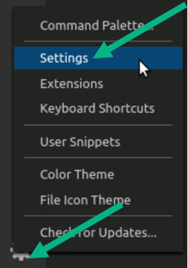
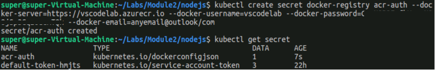

===

  

# Lab: Module 5 - Kubernetes Advanced Topics  

>Duration: 75 minutes  

# Table of Contents

[Exercise: Working with Helm Charts](#exercise-working-with-helm-charts)


[Exercise: Working with Init Containers](#exercise-working-with-init-containers)

[Exercise: Working with PostStart Container Hooks](#exercise-working-with-poststart-container-hooks)


**Objectives**  

Lab provides exposure to various Kubernetes topics:  

  - Creating and deploying Kubernetes multi-container application using
Helm Charts  

  - Using Visual Studio Code to deploy Docker containers in AKS  
  
  - Creating and using InitContainers  

  - Creating and using PostStart container hooks  

  - Using ACI-Connector with Azure Kubernetes Service  
  ---


### Login to your Azure Subscription
Launch Lab environment for Module 4 (this may take several minutes)

  

On the the **resources** tab then **Use Another Account**


Login into your lab Azure Subscription using the credentials provided on the resources tab


All the labs will require an AKS cluster to be up and running. Make sure you are connected to the AKS cluster with the following command executed in a terminal:  

`kubectl config current-context`  

It should return **aks-k8s-cluster**. If that is not the case, run:  

`az aks get-credentials --resource-group "USE CLOUD SLICE ASSIGNED RESOURCE GROUP" --name aks-k8s-cluster`  

## Exercise: Working with Helm Charts 

In this exercise you will use Helm charts to deploy a
multi-container application. Helm is a powerful tool that helps you manage
Kubernetes applications. Helm Charts are core components of Helm that
helps you define, install, and upgrade Kubernetes application.

The multi-container application consists of a front-end ASP .NET Core web
application and a Redis back-end. Overall, the application itself is
very simple but it helps you understand all the basic components of Helm.

## Tasks

**Task 1 - Understanding Helm Charts Structure**  

Helm charts follow a folder structure pattern. Typically, it looks like following  
    
    /parent-application    
    chart.yaml   
    /templates   
    /charts  
    /charts/application-1  
    /charts/application-1/templates  

In our case we have two applications. From the Helm charts
perspective, we have defined the **front-end** as the parent application and the **back-end** application sits below it.    
Lets' view the folder structure for **voting-application** that
contains Helm Charts for both the **front-end** and **back-end** application.

1. Run the following commands:  
   `cd ~/k8s-labs/Module2`  
   `code .`    
   

     

2. Notice that you have a **templates** folder right underneath the main
   application folder and then another **charts** folder which also has another
   **templates** folder. Since we have two applications, **front-end** and
   **back-end**, we want to segregate the YAML files into two separate
   folders resulting in two charts. These charts are related because **front-end** and **back-end** are within the same root.  
   Let's explore more closely the YAML files within these folders. This
   will give you better understanding on how various files are placed
   within this hierarchy.

  
>Helm Charts directory structure for complex applications can grow quite
>deep. Since we are just starting to work with Helm, keeping things
>simple make sense. However, you should look at the mature product like
>OpenStack and its entire Helm chart structure available at
><https://github.com/sapcc/helm-charts/tree/master/openstack>. This
>should give you a good idea on how Helm Charts are structure for more
>advanced applications.  
>Notice that inside the OpenStack Helm folder structure, how all the
>subcomponents are divided into sub charts (via sub folders). For
>example, Elektra is Web UI with a PostgreSQL backend sits level below
>within the main charts folder -
><https://github.com/sapcc/helm-charts/tree/master/openstack/elektra>  

3. Now back to our Chart. Let's examine these files closely. **Chart.yaml** is a Helm specific file
   that contains a basic set of information or metadata about the Helm
   application package. This includes application version number etc. Notice
   that there are two different **Chart.yaml** files, each file corresponds
   to one of the applications that we are planning to deploy (i.e.,
   front-end and back-end).  

4. Review the content of **Chart.yaml** file for the **front-end**
   application by running following command.  
   `cd voting-app-helm`  
   `cat Chart.yaml`  

   

​	Chart files do not contain application specific details
​	including image name, deployment, services etc. For that, you use
​	**values.yaml** file, which acts like a centralized location to define
​	application specific details for all the Kubernetes artifacts.  

5. Let's view the contents of **values.yaml** for the front-end
   application.  
   `cat values.yaml`  

  

​	Notice we have name, **replicaCount** etc. These are the values that we
​	will reference within the Deployment and Service definition files for
​	the **front-end** application.  

6. Let's view the content of **voting-frontend-dep.yaml** located in the
   templates folder.  


​	The deployment file for the **front-end** application is not much
​	different from the type deployment file you worked with before using
​	Helm, but it does contain placeholders for certain fields. These
​	placeholders will read the values from the **values.yaml** file and replace
​	the placeholder with that value. This way, you just focus on defining the
​	structure and leave most of the specifics to be defined in values file.
​	However, you can always define specific values and not read them from
​	values file. In this case notice that the values of CPU limits and
​	requests in the deployment file are hardcoded and are not read from
​	values file.  

7. At any point if you like to make sure that the Helm CLI is working correctly, run
   the following command:   
   ``helm version``  


**Task 2 - Verifying a Helm Chart**

1. Before you deploy the chart, you can optionally verify it. This
   helps in making sure that everything is defined correctly, and all
   values are exactly what you want them to be.  
   `cd ~/k8s-labs/Module2`  

2. To verify the helm chart run following command:  
   `helm template ./voting-app-helm`  

   The output of this command will display all the YAML files within the
   templates folder (for both **front-end** and **back-end**). Notice
   that the output contains the actual values for all the templates
   files after being replaced with the values from **values.yaml**
   file. These are the final values and if you found something missing
   or a discrepancy then you may want to change the **values.yaml**
   file as needed.   

**Task 3 - Installing a Helm Chart**  

1. Installing a Helm chart means that you will ask helm install all the deployments specified in your chart(s).  This will install the **front-end** and **back-end**
   applications through Helm chart. Notice you don't have to run the 
   `kubectl apply` command since Helm will take care of installing
   all the relevant files since you already defined them into the template
   folder earlier. Also, the **--name** parameter is used to give a unique name
   to this installation. In Helm, you refer to the installed application
   with a release name. To accomplish this all this automatically run the following
   command.  
   `helm install votingapp ./voting-app-helm`  


   Please note the installation may take few minutes.  Run the following command until the pods status changes to **Running**  
   `kubectl get pods`


**Task 4 - Listing a Helm Chart**  

1. You can list all the releases by running following command.  
   `helm ls`  

   The output will provide you with details including release name, status,
   chart details, app version etc.  

**Task 5 - Accessing Voting Application**  

1. Once deployed, you can run the following command to see the external
   IP created as part of the Load Balancer service.  
   `kubectl get svc`  

  

2. Open the browser and navigate to **http://\<external\_ip\>**. Once the
   application home page is displayed you should able to vote.  

  


**Task 6 - Upgrade Release**   

Now we will see how the upgrade process works Helm. 

1. Open the Chart.yaml file and update the appversion to 2.0.

```code ./voting-app-helm/Chart.yaml```

   appVersion: "2.0" </br>
   Now let us upgrade the Helm chart. 

Press **CTRL+S** to save changes and **CTRL+Q** to exit editor

   `helm upgrade votingapp ./voting-app-helm/`

   Now we will check the history of the deployment.

   `helm history votingapp`

   `helm ls`
 

**Task 7 - Rollback Release**   

1. We will see how the rollback process works Helm. Let us rollback to the previous release which is 1.0
   
   `helm rollback votingapp`

   Check the status of current release after the rollback.

   `helm ls`
 
   As you can see the release is rolled back to 1.0

**Task 8 - Deleting a Helm Chart**   

1. When you no longer need the application, you can delete the Helm
   chart. Remember, we have installed a multi-container application using
   a single command earlier, and now you can remove it again with simple
   commands. 

   `helm uninstall votingapp`  

   
## Exercise: Working with Visual Studio Code (Optional) 

In this exercise, you will learn how Visual Studio Code can help when working
with Kubernetes clusters. Visual Studio Code provides a consistent user
experience across Windows, MAC OS and Linux operating systems.  

## Tasks

**Pre Task - Install Extensions**  
Make sure you have the latest versions of these extensions installed.  
 - Azure Tools
 - Kubernetes
 - Docker

**Task 1 - Creating Azure Container Registry**  

To share container images, private registries can be used like
[Azure Container
Registry](https://docs.microsoft.com/en-us/azure/container-registry/).
As part of this exercise, we will be using a private registry hosted
in Azure.  

1. First open VS Code and open the Command Palette as shown below (or
   with **control-shift-p**).  

  

  

2. Enter **Azure sign in** the text box and select **Azure sign in**. It will open
   a browser and walk you through the sign in experience to authenticate
   the IDE.  

  

3. Click on the Docker Icon on the left, and go inside of the registry section and Connect Registry to Azure.


4. Create Registry using this approach. Follow the next steps on creating the registry by providing it a unique name and other information.


4. You will need to choose your subscription for billing purposes (select
   **Azure Pass** subscription). For the resource group, use the existing resource group you have.

   Then, you will need to select the Sku (keep **Standard**) and enter the Azure
   Container Registry name (it must be unique across all ofAzure) and location.
   At the end of these steps, you should see a notification saying that it
   has been successfully created (at the bottom right).  

5. To see the resource we have just deployed, navigate to
   [portal.azure.com](https://portal.azure.com/) and click on **All Services**.   

  

6. Then enter **Container registries** and click on **Container registries**.    

  

7. Finally, click on the registry we just created to access the **Overview**
   page.  

  

8. We have deployed a private Docker Container registry in Azure from
   Visual Studio Code.  

**Task 2 - Connecting VS Code to you ACR account and Kubernetes cluster**   

1. Now that you have successfully deployed the ACR, we need to
   authenticate VS Code to this private registry. To do this, we need
   to browse to our Container Registry as explained in the previous
   section and go to **Access keys** to find the credentials as shown
   below.  

2. Enable **Admin user** and take note of the **Login server**, **Username** and
   **Password**.  

  

3. From VS Code, open the **Settings** at the bottom left as shown below.  

  

4. Search for **vsdocker** and override the **Vsdocker: Image User** with
   name of the image. You need to put in the name of your login server, forward slash '/' and then vscodelab. What this does is place your container image into a repository named 'vscodelab'.

>   

5. At the top of VS Code, click on **Terminal** - **New Terminal**  

  

6. In the terminal window that has been opened, enter the command providing the username and the password found in the ACR environment.  
`docker login <login_server> -u <user_name> -p <password>`  


  

7. Before we can deploy a basic application to a Kubernetes cluster, we
   need to connect to the right cluster. Type the following commands from
   the VS Code terminal  
   `az login`  
   `az account set --subscription <YOUR-SUBSCRIPTION-ID>`  
   `az aks get-credentials --resource-group "USE THE CLOUD SLICE ASSIGNED RESOURCE GROUP" --name aks-k8s-cluster`  
   `kubectl config current-context`  

   It should return `aks-k8s-cluster`. If that is not the case, run:  
   `kubectl config set-context aks-k8s-cluster`   

**Task 3 - Deploy a NodeJS application to AKS from VS Code**    

1. From VS Code, click on **Explorer** and then **Open Folder**.  

     

1. Select the folder **~/labs/Module2/nodejs** and click **OK**. You can see
   the basic Node JS application provided, as well as a **Dockerfile** to
   build its image.  

     

1. Let's build the Docker image.  Right click on the **Dockerfile** and select **Build Image in Azure**

    

1. Enter **nodejs:latest"** as the Tag and press **Enter**
    

1. Select the subscription that you want to use.  

1. Choose the registry that was previously created.  
    


1.  Choose **Linux** as the base OS.

1. The image should now build and be published to your registry.  Watch the **Output** window for details.

   

1. Now open the **node.yaml** file and update the image to to the use the registry name that you previously created.  NOTE:  The registry name should also be in the output window.

   

1. Now we will push the yaml file to our cluster.  Open Command Palette by clicking on the **Settings** icon and then **Command Palette**  

     


1. Type **Kubernetes Create** and select it. It will deploy the application into your AKS cluster.

   

​	You can follow these steps at the bottom left of the IDE. The deployment should be created.  

     

5. Once complete, click on the Kubernetes extension, then expand the
   cluster and click **Workloads** - **Deployments** - **nodejs**. You will be able
   to see what is deployed in your cluster.    

     

**Task 4 - Troubleshooting and fixing a failing deployment**    

When expanding **nodejs**, you can see a red dot meaning that things did
not go as expected.  

1. Right-click on the failing pod and click **Describe**. 
- Scroll down and
   locate the message **Failed to pull image ...**, as highlighted in red
   below. If you scroll to the right, you will see that the pull failed
   because the AKS cluster is unauthorized to pull the image stored in
   the Azure Container Registry. We need to create a secret.  

  

2. To create a secret, open the VS Code Terminal and type the command  

``` bash
kubectl create secret docker-registry acr-auth  
    --docker-server=https://<acr_login_server>  
    --docker-username=<acr_user_name>  
    --docker-password=<acr_password>  
    --docker-email=<any_mail>
```

  

​	Although the secret is created, we need to make sure that its
​	credentials will be used to download the image at deployment time.  

3. From the Kubernetes extension window, click on the **nodejs** deployment
   to see the YAML file describing the deployment.  

  

4. After the **containers** section, update the file to add the following YAML section:  

``` yaml
imagePullSecrets:
  - name: acr-auth
```

  

5. Click **control-s** to save the changes and then finally, to update the deployment, open the Command Palette (or
   **control-shift-p**), search for **Apply** and select **Kubernetes: Apply**
   and click **Apply**.  

  

6. Now if you refresh the cluster's view, the **nodejs** pod should be healthy once the pull is complete. It will take a bit of time. Feel free to right click on the pod and **Describe**, it should show the event **pulling image...**   

   

**Task 5 - Exposing the deployment publicly with services**    

1. From the cluster's view, if you look under **Services**, you will see
   that the Node JS application is deployed but is not exposed through
   a service. To do this, open the Terminal and run  
   `kubectl expose deployments/nodejs --port=80 --target-port=8080 --type=LoadBalancer`  

  

​	Note the target port, which is 8080 because, as specified on the
​	**Dockerfile** that we used to build the image, we expect traffic to
​	come through the port 8080 in the container.  

2. Just like you did from the Linux terminal, we can follow the service
   creation from the VS Code terminal with the command (we can also do
   that by right clicking on the **nodejs** service created under **Services**
   and click **Get**):  
   `kubectl get svc`  

   

3. Once the service has been set up and the IP address has been created
   in Azure, you can refresh the cluster view and call the IP address
   from any browser.    

  

**Task 6 - Exploring more VS Code features**     

1. Another convenient integrated tool part of the Kubernetes extension
   is the `kubectl explain` command. Open a YAML file by clicking on **nodejs** deployment. Then open the Command Palette and enter
   **explain**. Then select **Kubernetes: Explain**.  

  

2. Now, hover over any field in the deployment YAML file to see some
   documentation and clickable links to learn more about the field.  

  

3. Finally, what you can do is open an interactive session with the running container for troubleshooting purpose. Right-click on the **nodejs** pod and
   click **Terminal**.  

  

4. You can type the `ls` or `cat server.js` commands to see what is inside the
   container file system. All of this, without leaving the VS Code IDE.  

  

**Task 7 - Cleaning up the Service and Deployment**    

1. From VS Code, we can also delete Kubernetes resources. Open the
   Command Palette, search for **Delete** and select **Kubernetes: Delete**.
   Type **service** and hit **enter**, this will delete the **nodejs** service.  

2. Start **Kubernetes: Delete** again, but this type **deployment** so that it
   deletes the **nodejs** deployment and clean everything up for the next
   exercise. You can refresh the cluster's view to check that **nodejs** is
   not under Deployments, Pods or Services.  


## Exercise: Working with Init Containers  

## Tasks  

**Task 1 - Creating the Init Container**  

First you will deploy the Pod that has both a regular application
container and the Init container defined.  

1. Make sure you are in a terminal window as super user and navigate to the
   **Labs/Module2**  
   `cd ~/Labs/Module2`  
   

2. You should open **init.yaml** and review its contents.  
   `cat init.yaml`  

3. Notice the use of the **initContainers** section with the command that
   checks if the **nginx** web server is accessible. As long as the nginx web server is not available, the init
   container will make sure that the application container, which is a busybox container, won't run.  
   `kubectl apply -f init.yaml`  

**Task 2 - Checking the Init Container**  

1. You should now check the status of the Pod.  
   `kubectl get pods`  

  

​	Notice that the status of **myapp-pod** shows **Init:0/1**. This means that 0 out of 1 init containers are still running. It will wait until init container's condition is satisfied and the main application pod won't run.  

2. You can check what's going on inside the Pod by running the command:  
   `kubectl describe pod myapp-pod`  

3. Scroll down to the conditions section within the output.  

  

4. Notice that the **myapp-container** is not initialized yet. This is
   exactly what you should expect because init container is still running.
   Lets' look at the logs to verify that.  
   `kubectl logs myapp-pod -c init-ngservice`  

   You should see "**Waiting for ngservice to come up**" message in the
   logs (ignore "**sh: 200: unknown operand**" message as it's not
   relevant).  

**Task 3 - Running the Init Container to Completion**  

1. Open **myservice.yaml**. Look for the two objects (a pod and a service) that will be created.  Verify the name of the service is the name that the init container is expecting.

1. To make sure that the init container condition has been met, run the following command. It's going to create a **nginx** service and pod The service endpoint, once up and running, will satisfy the init container condition since it will able to connect to it and get status 200 in return  
   `kubectl apply -f myservice.yaml`  


1. After waiting a bit, run the following command  
   `kubectl get pods`  

  

​	Notice that **myapp-pod** is now showing **Running** status (previously its **Init:0/1**), This means init container has completed its job and
​	is terminated.  

4. Now, check the logs for application container  
   `kubectl logs myapp-pod`  

5. Notice the message in the logs "**The app is running".** You can
   also run the *describe* command to gather more details about the Pod.  
   `kubectl describe pod myapp-pod`  

  

**Task 4 - Deleting Resources**  

Make sure to delete relevant resources before finishing this exercise.  
`kubectl delete svc ngservice`  
`kubectl delete pod myapp-pod ng-pod`  


## Exercise: Working with a PostStart Container Hooks   

A PostStart hook gets executed immediately after the container's main
process is started. Typically, you use a PostStart hook to perform extra
processing when the application starts. It especially comes in handy when
you don't have the application source code (third party applications) yet
still want to execute some logic as the container gets started.  

Please note that the hook runs in parallel (asynchronously) with the main
process, despite what its name suggest. So, don't assume that the main
process will wait for the post start hook to complete. However, if the post
start hook fails (return a non-zero exit code), the main container will
be killed.  

## Tasks  

**Task 1 - Creating a Pod with a Post Start Container Hook**  

The **hooks.yaml** file contains the Pod definition along with the
command that will run as the PostStart container hook executes.  

1. Open **hooks.yaml** and look at the **lifecycle** section.  In here you see the postStart hook and command that will be executed.  

1. Run the following command, to create a Pod with liveness probe.  
   `kubectl apply -f hooks.yaml`  

1. Wait for 5 seconds and then run the command to view Pod details.  
   `kubectl describe pods hooks`  

1. Scroll down and locate the **Events** section. The PostStart hook first
   echoed a message, then slept for 3 seconds and finally returned an
   exit code -1. Since the exit code is non-zero, the container was killed
   and re-created again. Initially, you will see **PostStartHookError**
   within the events section. However, as the PostHook will run again and
   once again returns an exit code of -1, the container will be killed again and re-created.  
   Again take a look at the yaml file we deployed to understand how the hook was specified and defined  
   `cat hooks.yaml`  

1. After a bit you can see how many times kubernets has tried to restart the pod.  
   `kubectl get pods`


**Task 2 - Deleting the Pod**  

1. Make sure to delete the Pod before closing this exercise  
   `kubectl delete pod hooks`  

# Congratulations you have completed Lab 5.